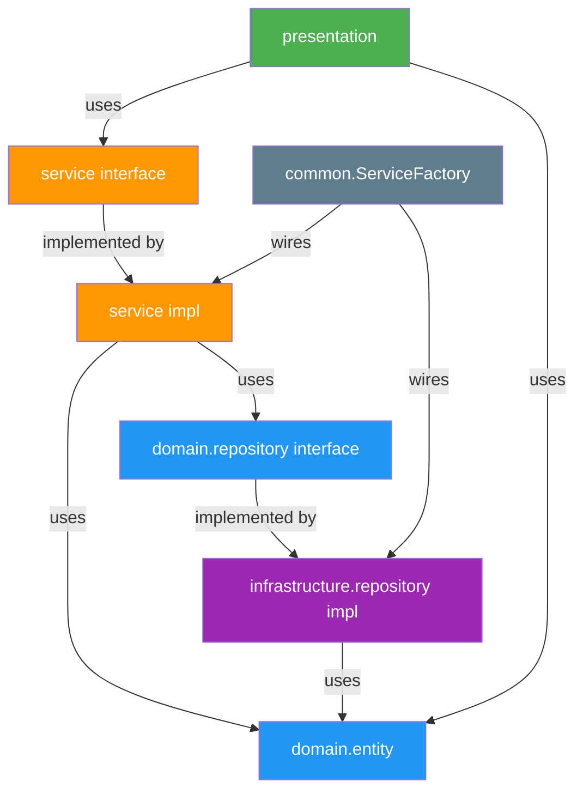

# 🗓️ KẾ HOẠCH SPRINT 3 NGÀY — ỨNG DỤNG QUẢN LÝ CỬA HÀNG THUỐC

> **Tech Stack:** Java 17 · Java Swing (FlatLaf) · SQL Server · Maven  
> **Kiến trúc:** Clean Architecture + SOLID Principles  
> **Thời gian:** 3 ngày × 3 buổi (Sáng / Chiều / Tối)  
> **Ngày bắt đầu:** 22/03/2026

---

## 🏛️ KIẾN TRÚC TỔNG QUAN — CLEAN ARCHITECTURE

```
┌─────────────────────────────────────────────────────────────┐
│                      PRESENTATION LAYER                     │
│                     (Java Swing - GUI)                       │
│              Chỉ biết về Service Interface                  │
├─────────────────────────────────────────────────────────────┤
│                      SERVICE LAYER (BUS)                    │
│              Business Logic + Validation                    │
│        Phụ thuộc vào Repository Interface (không impl)      │
├─────────────────────────────────────────────────────────────┤
│                      DOMAIN LAYER                           │
│          Entity (POJO) + Repository Interface               │
│            ★ KHÔNG PHỤ THUỘC BẤT KỲ LAYER NÀO ★           │
├─────────────────────────────────────────────────────────────┤
│                    INFRASTRUCTURE LAYER                     │
│        Repository Impl (DAO) + DatabaseHelper               │
│           Implement Repository Interface                    │
└─────────────────────────────────────────────────────────────┘
```

### 🔑 SOLID Principles áp dụng

| Principle | Áp dụng cụ thể |
|-----------|-----------------|
| **S** – Single Responsibility | Mỗi class chỉ 1 nhiệm vụ: Entity chứa data, Repository lo DB, Service lo logic, GUI lo hiển thị |
| **O** – Open/Closed | Thêm module mới (VD: Nhà cung cấp) → tạo entity + repo + service mới, KHÔNG sửa code cũ |
| **L** – Liskov Substitution | `IProductRepository` có thể swap giữa `ProductRepositoryImpl` (SQL Server) và `ProductRepositoryMock` (test) |
| **I** – Interface Segregation | Tách `IReportRepository` riêng, không nhồi method báo cáo vào `IProductRepository` |
| **D** – Dependency Inversion | Service phụ thuộc `IProductRepository` (interface), KHÔNG phụ thuộc `ProductRepositoryImpl` (concrete) |

---

## 📐 CẤU TRÚC PACKAGE

```
src/main/java/
│
├── domain/                              ★ CORE — Không phụ thuộc gì
│   ├── entity/                          # POJO thuần túy
│   │   ├── User.java
│   │   ├── Product.java
│   │   ├── Batch.java
│   │   ├── Customer.java
│   │   ├── Invoice.java
│   │   └── InvoiceDetail.java
│   │
│   ├── repository/                      # Interface — Chỉ khai báo contract
│   │   ├── IUserRepository.java
│   │   ├── IProductRepository.java
│   │   ├── IBatchRepository.java
│   │   ├── ICustomerRepository.java
│   │   ├── IInvoiceRepository.java
│   │   ├── IInvoiceDetailRepository.java
│   │   └── IReportRepository.java
│   │
│   └── dto/                             # Data Transfer Objects
│       ├── CartItem.java                # Item trong giỏ hàng (ko phải entity DB)
│       ├── RevenueDTO.java              # DTO cho card doanh thu
│       ├── TopSellingDTO.java           # DTO cho top bán chạy
│       └── TopCustomerDTO.java          # DTO cho top KH VIP
│
├── service/                             ★ BUSINESS LOGIC
│   ├── IAuthService.java               # Interface
│   ├── AuthServiceImpl.java            # Login + phân quyền
│   ├── IProductService.java
│   ├── ProductServiceImpl.java         # CRUD + validate sản phẩm
│   ├── IBatchService.java
│   ├── BatchServiceImpl.java           # Nhập kho + validate lô
│   ├── ICustomerService.java
│   ├── CustomerServiceImpl.java        # findOrCreate khách hàng
│   ├── ISaleService.java
│   ├── SaleServiceImpl.java            # ★ Checkout + FEFO — Logic cốt lõi
│   ├── IReportService.java
│   └── ReportServiceImpl.java          # Aggregate data cho Dashboard
│
├── infrastructure/                      ★ DATA ACCESS — Implement Interface
│   ├── database/
│   │   └── DatabaseHelper.java         # HikariCP Connection Pool
│   │
│   └── repository/                     # Concrete DAO implementations
│       ├── UserRepositoryImpl.java
│       ├── ProductRepositoryImpl.java
│       ├── BatchRepositoryImpl.java
│       ├── CustomerRepositoryImpl.java
│       ├── InvoiceRepositoryImpl.java
│       ├── InvoiceDetailRepositoryImpl.java
│       └── ReportRepositoryImpl.java
│
├── presentation/                        ★ GUI LAYER — Java Swing
│   ├── LoginFrame.java                 # Form đăng nhập
│   ├── MainFrame.java                  # Frame chính + Sidebar + Routing
│   ├── panel/
│   │   ├── DashboardPanel.java         # Cards + Tables báo cáo
│   │   ├── ProductPanel.java           # CRUD sản phẩm
│   │   ├── ImportPanel.java            # Nhập kho
│   │   ├── InventoryPanel.java         # Tồn kho chi tiết
│   │   ├── POSPanel.java              # Màn hình bán hàng
│   │   └── CustomerPanel.java         # DS khách + lịch sử
│   ├── dialog/
│   │   ├── ProductFormDialog.java      # Dialog thêm/sửa thuốc
│   │   └── InvoiceDetailDialog.java    # Dialog chi tiết hóa đơn
│   └── component/                      # Reusable UI components (SRP)
│       ├── StyledTable.java            # JTable custom (alternating rows, format)
│       ├── RevenueCard.java            # Card hiển thị doanh thu
│       └── SearchBar.java             # Ô tìm kiếm tái sử dụng
│
├── common/                              ★ SHARED UTILITIES
│   ├── Session.java                    # Lưu User đang đăng nhập
│   ├── CurrencyFormatter.java         # Format tiền VNĐ
│   ├── DateUtils.java                  # Helper cho Date
│   └── ServiceFactory.java            # ★ DI Container — Tạo & inject dependencies
│
└── App.java                            # Entry point — Khởi tạo ServiceFactory → LoginFrame

database/
├── 01_create_database.sql
├── 02_seed_data.sql
└── 03_stored_procedures.sql
```

---

## 🏭 DEPENDENCY INJECTION — `ServiceFactory.java`

> Thay vì mỗi class tự `new` dependency, dùng **ServiceFactory** làm DI Container đơn giản.
> Tuân thủ **Dependency Inversion**: Service nhận Interface, không biết Impl.

```java
public class ServiceFactory {
    // === Repository Instances (Singleton) ===
    private static final IUserRepository userRepo = new UserRepositoryImpl();
    private static final IProductRepository productRepo = new ProductRepositoryImpl();
    private static final IBatchRepository batchRepo = new BatchRepositoryImpl();
    private static final ICustomerRepository customerRepo = new CustomerRepositoryImpl();
    private static final IInvoiceRepository invoiceRepo = new InvoiceRepositoryImpl();
    private static final IInvoiceDetailRepository invoiceDetailRepo = new InvoiceDetailRepositoryImpl();
    private static final IReportRepository reportRepo = new ReportRepositoryImpl();

    // === Service Instances — Inject repos qua constructor ===
    public static IAuthService getAuthService() {
        return new AuthServiceImpl(userRepo);
    }

    public static IProductService getProductService() {
        return new ProductServiceImpl(productRepo);
    }

    public static IBatchService getBatchService() {
        return new BatchServiceImpl(batchRepo, productRepo);
    }

    public static ICustomerService getCustomerService() {
        return new CustomerServiceImpl(customerRepo);
    }

    public static ISaleService getSaleService() {
        return new SaleServiceImpl(
            invoiceRepo, invoiceDetailRepo,
            batchRepo, customerRepo
        );
    }

    public static IReportService getReportService() {
        return new ReportServiceImpl(reportRepo);
    }
}
```

**Cách sử dụng trong GUI:**
```java
// Trong POSPanel.java — GUI chỉ biết Interface, ko biết Impl
private final ISaleService saleService = ServiceFactory.getSaleService();
private final IProductService productService = ServiceFactory.getProductService();
```

---

## 📊 THIẾT KẾ DATABASE TỔNG QUAN

| # | Bảng | Mô tả | Ngày tạo |
|---|------|--------|-----------|
| 1 | `NguoiDung` | Tài khoản đăng nhập (username, password, role) | Ngày 1 – Sáng |
| 2 | `SanPham` | Danh mục thuốc (tên, đơn vị, giá nhập, giá bán, trạng thái) | Ngày 1 – Chiều |
| 3 | `LoHang` | Lô nhập kho (mã lô, FK sản phẩm, HSD, số lượng) | Ngày 1 – Tối |
| 4 | `KhachHang` | Khách hàng (SĐT, tên) | Ngày 2 – Sáng |
| 5 | `HoaDon` | Hóa đơn bán hàng (ngày, FK khách hàng, tổng tiền) | Ngày 2 – Sáng |
| 6 | `ChiTietHoaDon` | Chi tiết hóa đơn (FK hóa đơn, FK lô hàng, SL, đơn giá) | Ngày 2 – Sáng |

---

# 🟢 NGÀY 1 — NỀN TẢNG: Infrastructure + Domain + Auth + Product + Batch

## Buổi Sáng (3-4h) — Setup Clean Architecture + Module Auth

### 🗄️ SQL

```sql
CREATE TABLE NguoiDung (
    MaND        INT IDENTITY(1,1) PRIMARY KEY,
    TenDangNhap NVARCHAR(50) NOT NULL UNIQUE,
    MatKhau     NVARCHAR(255) NOT NULL,
    HoTen       NVARCHAR(100) NOT NULL,
    VaiTro      NVARCHAR(20) NOT NULL DEFAULT 'NhanVien',
    TrangThai   BIT DEFAULT 1,
    NgayTao     DATETIME DEFAULT GETDATE()
);

INSERT INTO NguoiDung (TenDangNhap, MatKhau, HoTen, VaiTro)
VALUES ('admin', 'admin123', N'Quản trị viên', 'Admin');
INSERT INTO NguoiDung (TenDangNhap, MatKhau, HoTen, VaiTro)
VALUES ('nhanvien01', 'nv123', N'Nhân viên 01', 'NhanVien');
```

### 📦 Java Classes — Theo thứ tự code

| # | Package | Class | SOLID | Nhiệm vụ |
|---|---------|-------|-------|-----------|
| 1 | `infrastructure.database` | `DatabaseHelper.java` | SRP | HikariCP DataSource, `getConnection()` |
| 2 | `common` | `Session.java` | SRP | Static: lưu `currentUser` |
| 3 | `common` | `ServiceFactory.java` | DIP | DI Container: tạo & inject tất cả dependencies |
| 4 | `domain.entity` | `User.java` | SRP | POJO thuần túy, không DB logic |
| 5 | `domain.repository` | `IUserRepository.java` | ISP, DIP | `findByCredentials(user, pass)` |
| 6 | `infrastructure.repository` | `UserRepositoryImpl.java` | LSP | Implement `IUserRepository` bằng SQL |
| 7 | `service` | `IAuthService.java` | ISP | Interface: `login(user, pass)` |
| 8 | `service` | `AuthServiceImpl.java` | SRP, DIP | Validate → gọi `IUserRepository` |
| 9 | `presentation` | `LoginFrame.java` | SRP | Chỉ lo UI, gọi `IAuthService` |
| 10 | `presentation` | `MainFrame.java` | SRP, OCP | Sidebar + CardLayout, ẩn/hiện theo role |
| 11 | `App.java` | `App.java` | — | Entry point: FlatLaf → LoginFrame |

### ✅ Acceptance Criteria
- [ ] Tất cả package đã tạo đúng cấu trúc Clean Architecture
- [ ] `ServiceFactory` inject `IUserRepository` vào `AuthServiceImpl`
- [ ] Đăng nhập đúng → `MainFrame`, sai → lỗi
- [ ] Admin → tất cả menu, NhanVien → ẩn menu Admin

---

## Buổi Chiều (3-4h) — Module Product (CRUD Master Data)

### 🗄️ SQL

```sql
CREATE TABLE SanPham (
    MaSP      INT IDENTITY(1,1) PRIMARY KEY,
    TenSP     NVARCHAR(200) NOT NULL,
    DonViTinh NVARCHAR(50) NOT NULL,
    GiaNhap   DECIMAL(18,0) NOT NULL,
    GiaBan    DECIMAL(18,0) NOT NULL,
    TrangThai BIT DEFAULT 1,
    NgayTao   DATETIME DEFAULT GETDATE()
);
```

### 📦 Java Classes

| # | Package | Class | SOLID | Nhiệm vụ |
|---|---------|-------|-------|-----------|
| 1 | `domain.entity` | `Product.java` | SRP | POJO thuần túy |
| 2 | `domain.repository` | `IProductRepository.java` | ISP | `getAll()`, `getById()`, `insert()`, `update()`, `softDelete()`, `search()` |
| 3 | `infrastructure.repository` | `ProductRepositoryImpl.java` | LSP | SQL Server implementation |
| 4 | `service` | `IProductService.java` | ISP | Interface cho product business logic |
| 5 | `service` | `ProductServiceImpl.java` | SRP, DIP | Validate (tên ≠ empty, giá > 0) → `IProductRepository` |
| 6 | `presentation.panel` | `ProductPanel.java` | SRP | JTable + Search + CRUD buttons |
| 7 | `presentation.dialog` | `ProductFormDialog.java` | SRP | JDialog thêm/sửa thuốc |

### ✅ Acceptance Criteria
- [ ] `ProductServiceImpl` nhận `IProductRepository` qua **constructor injection**
- [ ] CRUD hoạt động đúng, soft delete cho SP có giao dịch
- [ ] Tìm kiếm theo tên thuốc real-time

---

## Buổi Tối (3-4h) — Module Batch & Inventory

### 🗄️ SQL

```sql
CREATE TABLE LoHang (
    MaLo       INT IDENTITY(1,1) PRIMARY KEY,
    MaSP       INT NOT NULL FOREIGN KEY REFERENCES SanPham(MaSP),
    SoLo       NVARCHAR(50) NOT NULL,
    HanSuDung  DATE NOT NULL,
    SoLuong    INT NOT NULL DEFAULT 0,
    NgayNhap   DATETIME DEFAULT GETDATE()
);

CREATE INDEX IX_LoHang_FEFO ON LoHang(MaSP, HanSuDung ASC) WHERE SoLuong > 0;
```

### 📦 Java Classes

| # | Package | Class | SOLID | Nhiệm vụ |
|---|---------|-------|-------|-----------|
| 1 | `domain.entity` | `Batch.java` | SRP | POJO |
| 2 | `domain.repository` | `IBatchRepository.java` | ISP | `insert()`, `getByProductId()`, `getAllWithProduct()`, `getFEFO()`, `updateQuantity()` |
| 3 | `infrastructure.repository` | `BatchRepositoryImpl.java` | LSP | SQL implementation + FEFO query |
| 4 | `service` | `IBatchService.java` | ISP | Interface |
| 5 | `service` | `BatchServiceImpl.java` | SRP, DIP | Validate HSD, SL → `IBatchRepository` |
| 6 | `presentation.panel` | `ImportPanel.java` | SRP | Form nhập kho |
| 7 | `presentation.panel` | `InventoryPanel.java` | SRP | JTable tồn kho chi tiết theo lô |

### ✅ Acceptance Criteria
- [ ] Nhập kho → lưu lô mới, 1 SP có nhiều lô
- [ ] `InventoryPanel` hiển thị chi tiết từng lô
- [ ] Validate: HSD > hôm nay, SL > 0

---

# 🟡 NGÀY 2 — CORE BUSINESS: Customer + POS (FEFO) + Invoice History

## Buổi Sáng (3-4h) — Module Customer + Invoice Domain

### 🗄️ SQL

```sql
CREATE TABLE KhachHang (
    MaKH    INT IDENTITY(1,1) PRIMARY KEY,
    SoDT    VARCHAR(15) NOT NULL UNIQUE,
    TenKH   NVARCHAR(100),
    NgayTao DATETIME DEFAULT GETDATE()
);

CREATE TABLE HoaDon (
    MaHD      INT IDENTITY(1,1) PRIMARY KEY,
    MaKH      INT NULL FOREIGN KEY REFERENCES KhachHang(MaKH),
    MaND      INT NOT NULL FOREIGN KEY REFERENCES NguoiDung(MaND),
    NgayBan   DATETIME DEFAULT GETDATE(),
    TongTien  DECIMAL(18,0) NOT NULL DEFAULT 0
);

CREATE TABLE ChiTietHoaDon (
    MaCTHD   INT IDENTITY(1,1) PRIMARY KEY,
    MaHD     INT NOT NULL FOREIGN KEY REFERENCES HoaDon(MaHD),
    MaLo     INT NOT NULL FOREIGN KEY REFERENCES LoHang(MaLo),
    MaSP     INT NOT NULL FOREIGN KEY REFERENCES SanPham(MaSP),
    SoLuong  INT NOT NULL,
    DonGia   DECIMAL(18,0) NOT NULL,
    ThanhTien DECIMAL(18,0) NOT NULL
);
```

### 📦 Java Classes

| # | Package | Class | SOLID | Nhiệm vụ |
|---|---------|-------|-------|-----------|
| 1 | `domain.entity` | `Customer.java` | SRP | POJO |
| 2 | `domain.entity` | `Invoice.java` | SRP | POJO |
| 3 | `domain.entity` | `InvoiceDetail.java` | SRP | POJO |
| 4 | `domain.dto` | `CartItem.java` | SRP | DTO giỏ hàng (không phải entity DB) |
| 5 | `domain.repository` | `ICustomerRepository.java` | ISP | `findByPhone()`, `insert()`, `getAll()` |
| 6 | `domain.repository` | `IInvoiceRepository.java` | ISP | `insert()`, `getByCustomerId()`, `updateTotal()` |
| 7 | `domain.repository` | `IInvoiceDetailRepository.java` | ISP | `insert()`, `getByInvoiceId()` |
| 8 | `infrastructure.repository` | `CustomerRepositoryImpl.java` | LSP | SQL implementation |
| 9 | `infrastructure.repository` | `InvoiceRepositoryImpl.java` | LSP | SQL implementation |
| 10 | `infrastructure.repository` | `InvoiceDetailRepositoryImpl.java` | LSP | SQL implementation |
| 11 | `service` | `ICustomerService.java` | ISP | Interface |
| 12 | `service` | `CustomerServiceImpl.java` | SRP | `findOrCreate(sdt, ten)` |

### ✅ Acceptance Criteria
- [ ] `findOrCreate` → SĐT mới: insert, SĐT cũ: trả KH có sẵn
- [ ] Tất cả Repository Impl nhận `Connection` từ `DatabaseHelper`
- [ ] DAO insert trả về auto-generated ID

---

## Buổi Chiều (4-5h) ⭐ — Module POS: Bán hàng + FEFO (TRỌNG TÂM)

### 📦 Java Classes

| # | Package | Class | SOLID | Nhiệm vụ |
|---|---------|-------|-------|-----------|
| 1 | `service` | `ISaleService.java` | ISP | Interface: `checkout(cart, sdt, tenKH)` |
| 2 | `service` | `SaleServiceImpl.java` | SRP, DIP | ★ Core logic: FEFO + Transaction |
| 3 | `presentation.panel` | `POSPanel.java` | SRP | UI bán hàng |

### 🔥 `SaleServiceImpl.java` — Dependency Injection rõ ràng

```java
public class SaleServiceImpl implements ISaleService {

    // ★ DIP: Phụ thuộc Interface, KHÔNG phụ thuộc Impl
    private final IInvoiceRepository invoiceRepo;
    private final IInvoiceDetailRepository detailRepo;
    private final IBatchRepository batchRepo;
    private final ICustomerRepository customerRepo;

    // ★ Constructor Injection
    public SaleServiceImpl(
        IInvoiceRepository invoiceRepo,
        IInvoiceDetailRepository detailRepo,
        IBatchRepository batchRepo,
        ICustomerRepository customerRepo
    ) {
        this.invoiceRepo = invoiceRepo;
        this.detailRepo = detailRepo;
        this.batchRepo = batchRepo;
        this.customerRepo = customerRepo;
    }

    @Override
    public boolean checkout(List<CartItem> cart, String sdt, String tenKH) {
        Connection conn = DatabaseHelper.getConnection();
        conn.setAutoCommit(false);
        try {
            // 1. Find or Create Customer
            Customer kh = findOrCreateCustomer(conn, sdt, tenKH);

            // 2. Create Invoice
            Invoice hd = new Invoice(kh.getMaKH(), Session.getCurrentUser().getMaND());
            int maHD = invoiceRepo.insert(conn, hd);

            // 3. Process each CartItem with FEFO
            for (CartItem item : cart) {
                if (!processCartItemFEFO(conn, maHD, item)) {
                    conn.rollback();
                    return false; // Không đủ tồn kho
                }
            }

            // 4. Update Invoice total
            invoiceRepo.updateTotal(conn, maHD);
            conn.commit();
            return true;
        } catch (Exception e) {
            conn.rollback();
            throw new RuntimeException("Checkout failed", e);
        }
    }

    // ★ SRP: Tách method riêng cho FEFO logic
    private boolean processCartItemFEFO(Connection conn, int maHD, CartItem item) {
        int remaining = item.getSoLuong();
        List<Batch> lots = batchRepo.getFEFO(conn, item.getMaSP());

        for (Batch lot : lots) {
            if (remaining <= 0) break;
            int deduct = Math.min(remaining, lot.getSoLuong());

            batchRepo.updateQuantity(conn, lot.getMaLo(), lot.getSoLuong() - deduct);
            detailRepo.insert(conn, new InvoiceDetail(
                maHD, lot.getMaLo(), item.getMaSP(), deduct, item.getGiaBan()
            ));
            remaining -= deduct;
        }
        return remaining <= 0;
    }
}
```

### 🖥️ Bố cục `POSPanel.java`

```
┌──────────────────────────────────────────────────────┐
│  🔍 Tìm thuốc: [____________] [Tìm]                 │
│                                                      │
│  ┌─ Kết quả tìm kiếm ──────┐  ┌─ Giỏ hàng ───────┐ │
│  │ Tên     | ĐVT  | Giá bán │  │ Tên  | SL | Tiền  │ │
│  │ ........|......|.........│  │ .....|....|...... │ │
│  │ [Thêm vào giỏ]          │  │ [Xóa khỏi giỏ]   │ │
│  └──────────────────────────┘  └────────────────────┘ │
│                                                      │
│  SĐT Khách: [__________]  Tên KH: [__________]      │
│                                                      │
│  ┌────────────────────────────────────────────┐      │
│  │ Tổng tiền:               1,250,000 VNĐ    │      │
│  │ Khách đưa:  [__________]                   │      │
│  │ Tiền thừa:               250,000 VNĐ      │      │
│  │         [💰 THANH TOÁN]                    │      │
│  └────────────────────────────────────────────┘      │
└──────────────────────────────────────────────────────┘
```

### ✅ Acceptance Criteria
- [ ] `SaleServiceImpl` nhận 4 interface qua constructor (DIP)
- [ ] FEFO trừ kho đúng thứ tự HSD tăng dần
- [ ] Transaction: rollback nếu không đủ tồn kho
- [ ] GUI `POSPanel` chỉ gọi `ISaleService`, không biết implement cụ thể

---

## Buổi Tối (3-4h) — Customer History + Invoice Detail

### 📦 Java Classes

| # | Package | Class | SOLID | Nhiệm vụ |
|---|---------|-------|-------|-----------|
| 1 | `service` | `IInvoiceService.java` | ISP | Tách riêng khỏi SaleService (ISP) |
| 2 | `service` | `InvoiceServiceImpl.java` | SRP | `getByCustomerId()`, `getDetails()` |
| 3 | `presentation.panel` | `CustomerPanel.java` | SRP | JTable khách hàng + click → hóa đơn |
| 4 | `presentation.dialog` | `InvoiceDetailDialog.java` | SRP | Chi tiết 1 hóa đơn |

### ✅ Acceptance Criteria
- [ ] Tách `IInvoiceService` riêng (ko nhồi vào `ISaleService` — ISP)
- [ ] Xem DS khách → click → DS hóa đơn → click → chi tiết
- [ ] Tìm khách theo SĐT hoặc Tên

---

# 🔴 NGÀY 3 — DASHBOARD + REUSABLE COMPONENTS + TESTING

## Buổi Sáng (3-4h) — Module Dashboard & Report

### 🗄️ SQL Queries

```sql
-- Doanh thu hôm nay
SELECT ISNULL(SUM(TongTien), 0) FROM HoaDon
WHERE CAST(NgayBan AS DATE) = CAST(GETDATE() AS DATE);

-- Doanh thu tháng này
SELECT ISNULL(SUM(TongTien), 0) FROM HoaDon
WHERE MONTH(NgayBan) = MONTH(GETDATE()) AND YEAR(NgayBan) = YEAR(GETDATE());

-- Doanh thu quý này
SELECT ISNULL(SUM(TongTien), 0) FROM HoaDon
WHERE DATEPART(QUARTER, NgayBan) = DATEPART(QUARTER, GETDATE())
  AND YEAR(NgayBan) = YEAR(GETDATE());

-- Cảnh báo hết hạn (≤ 3 tháng)
SELECT sp.TenSP, lh.SoLo, lh.HanSuDung, lh.SoLuong
FROM LoHang lh JOIN SanPham sp ON lh.MaSP = sp.MaSP
WHERE lh.SoLuong > 0 AND lh.HanSuDung <= DATEADD(MONTH, 3, GETDATE())
ORDER BY lh.HanSuDung ASC;

-- Top 5 bán chạy
SELECT TOP 5 sp.TenSP, SUM(ct.SoLuong) AS TongBan
FROM ChiTietHoaDon ct JOIN SanPham sp ON ct.MaSP = sp.MaSP
GROUP BY sp.TenSP ORDER BY TongBan DESC;

-- Top khách VIP
SELECT TOP 5 kh.TenKH, kh.SoDT, SUM(hd.TongTien) AS TongMua
FROM HoaDon hd JOIN KhachHang kh ON hd.MaKH = kh.MaKH
GROUP BY kh.TenKH, kh.SoDT ORDER BY TongMua DESC;
```

### 📦 Java Classes

| # | Package | Class | SOLID | Nhiệm vụ |
|---|---------|-------|-------|-----------|
| 1 | `domain.dto` | `RevenueDTO.java` | SRP | DTO: today, month, quarter |
| 2 | `domain.dto` | `TopSellingDTO.java` | SRP | DTO: productName, totalQty |
| 3 | `domain.dto` | `TopCustomerDTO.java` | SRP | DTO: customerName, phone, totalSpent |
| 4 | `domain.repository` | `IReportRepository.java` | ISP | Tách riêng khỏi các repo khác |
| 5 | `infrastructure.repository` | `ReportRepositoryImpl.java` | LSP | SQL queries cho báo cáo |
| 6 | `service` | `IReportService.java` | ISP | Interface |
| 7 | `service` | `ReportServiceImpl.java` | SRP, DIP | Aggregate data cho GUI |
| 8 | `presentation.panel` | `DashboardPanel.java` | SRP | 3 Cards + 3 Tables |
| 9 | `presentation.component` | `RevenueCard.java` | SRP, OCP | Component tái sử dụng cho card |

### 🖥️ Bố cục `DashboardPanel.java`

```
┌──────────────────────────────────────────────────────┐
│  ┌──────────┐  ┌──────────────┐  ┌──────────────┐   │
│  │ HÔM NAY  │  │  THÁNG NÀY   │  │   QUÝ NÀY   │   │
│  │ 2,500,000│  │  85,000,000  │  │ 240,000,000  │   │
│  └──────────┘  └──────────────┘  └──────────────┘   │
│  ┌─ ⚠️ Cảnh báo Hết hạn ────────────────────────┐   │
│  │ Thuốc     | Số lô  | HSD        | SL còn     │   │
│  └───────────────────────────────────────────────┘   │
│  ┌─ 🏆 Top 5 Bán chạy ──┐  ┌─ 👑 Top KH VIP ───┐  │
│  │ Tên thuốc  | Tổng bán │  │ KH     | Tổng mua  │  │
│  └────────────────────────┘  └────────────────────┘  │
└──────────────────────────────────────────────────────┘
```

### ✅ Acceptance Criteria
- [ ] `IReportRepository` tách riêng (không nhồi vào Product/Batch repo — ISP)
- [ ] `RevenueCard` là component tái sử dụng (OCP — thêm card mới không sửa code cũ)
- [ ] Dashboard chỉ hiện cho Admin

---

## Buổi Chiều (3-4h) — Reusable Components + UI Polish + Integration Test

### 🎨 Reusable Components (OCP + SRP)

| # | Package | Class | Mô tả |
|---|---------|-------|--------|
| 1 | `presentation.component` | `StyledTable.java` | JTable custom: alternating rows, auto-resize, format tiền |
| 2 | `presentation.component` | `SearchBar.java` | Ô tìm kiếm tái sử dụng cho mọi Panel |
| 3 | `common` | `CurrencyFormatter.java` | `format(amount)` → "1,250,000 ₫" |
| 4 | `common` | `DateUtils.java` | `formatDate()`, `isExpiringSoon()` |

### 🧪 Integration Testing Checklist

| # | Test Case | SOLID Check | Kết quả |
|---|-----------|-------------|---------|
| 1 | Đăng nhập Admin → tất cả menu | AuthService inject OK | ⬜ |
| 2 | Đăng nhập NhanVien → ẩn menu | MainFrame role check | ⬜ |
| 3 | CRUD thuốc qua `IProductService` | DIP verified | ⬜ |
| 4 | Soft delete thuốc đã có giao dịch | Business rule in Service | ⬜ |
| 5 | Nhập kho → tồn kho cập nhật | BatchService → IBatchRepo | ⬜ |
| 6 | POS: Bán hàng FEFO | SaleServiceImpl DIP | ⬜ |
| 7 | POS: Bán vượt tồn kho → rollback | Transaction in Service | ⬜ |
| 8 | KH mới tự tạo khi checkout | CustomerService findOrCreate | ⬜ |
| 9 | Lịch sử KH → đúng hóa đơn | IInvoiceService tách riêng (ISP) | ⬜ |
| 10 | Dashboard số liệu chính xác | IReportRepo tách riêng (ISP) | ⬜ |
| 11 | Swap Mock Repo → Service vẫn chạy | LSP verified | ⬜ |

---

## Buổi Tối (2-3h) — Fix Bug + Seed Data + Documentation

### 📋 Checklist cuối cùng

| # | Task | Trạng thái |
|---|------|------------|
| 1 | Fix tất cả bug từ Integration Test | ⬜ |
| 2 | Seed data đầy đủ (≥ 20 SP, ≥ 5 lô, ≥ 3 hóa đơn) | ⬜ |
| 3 | Viết `README.md` hướng dẫn cài đặt & chạy | ⬜ |
| 4 | Export `.sql` hoàn chỉnh → `database/` | ⬜ |
| 5 | Test full flow: Login → POS → Dashboard | ⬜ |
| 6 | Clean code: xóa comment thừa, format code | ⬜ |
| 7 | Verify: mọi Service chỉ phụ thuộc Interface | ⬜ |
| 8 | Commit & push lên GitHub | ⬜ |

---

## 📈 TỔNG KẾT DELIVERABLES

| Layer | Deliverable | Số lượng |
|-------|-------------|----------|
| **Database** | Bảng SQL | 6 |
| **Domain** | Entity (POJO) | 6 |
| **Domain** | DTO | 3 |
| **Domain** | Repository Interface | 7 |
| **Infrastructure** | Repository Impl (DAO) | 7 |
| **Infrastructure** | DatabaseHelper | 1 |
| **Service** | Service Interface | 6 |
| **Service** | Service Impl | 6 |
| **Presentation** | Frame | 2 |
| **Presentation** | Panel | 6 |
| **Presentation** | Dialog | 2 |
| **Presentation** | Reusable Component | 3 |
| **Common** | Utility | 4 |
| | **Tổng Java classes** | **~59 class** |

---

## 📊 DEPENDENCY FLOW (Tuân thủ Clean Architecture)



**Quy tắc vàng:** Mũi tên chỉ hướng VÀO trong (Presentation → Service → Domain ← Infrastructure). Domain **KHÔNG BAO GIỜ** phụ thuộc ra ngoài.

---

## ⏰ TIMELINE TỔNG QUAN

```
NGÀY 1                      NGÀY 2                      NGÀY 3
┌───────────────────┐      ┌───────────────────┐      ┌───────────────────┐
│ 🌅 SÁNG            │      │ 🌅 SÁNG            │      │ 🌅 SÁNG            │
│ Infrastructure +  │      │ Customer +        │      │ IReportRepo +     │
│ Domain User +     │      │ Invoice Domain +  │      │ ReportServiceImpl │
│ ServiceFactory +  │      │ DTO CartItem +    │      │ DashboardPanel +  │
│ Auth Module       │      │ All Repo Impls    │      │ RevenueCard       │
├───────────────────┤      ├───────────────────┤      ├───────────────────┤
│ 🌇 CHIỀU           │      │ 🌇 CHIỀU ⭐         │      │ 🌇 CHIỀU           │
│ IProductRepo +    │      │ ISaleService +    │      │ StyledTable +     │
│ ProductRepoImpl + │      │ SaleServiceImpl + │      │ SearchBar +       │
│ ProductService +  │      │ FEFO Logic +      │      │ UI Polish +       │
│ ProductPanel      │      │ POSPanel          │      │ Integration Test  │
├───────────────────┤      ├───────────────────┤      ├───────────────────┤
│ 🌙 TỐI             │      │ 🌙 TỐI             │      │ 🌙 TỐI             │
│ IBatchRepo +      │      │ IInvoiceService + │      │ Fix bugs +        │
│ BatchRepoImpl +   │      │ CustomerPanel +   │      │ Seed data +       │
│ BatchService +    │      │ InvoiceDetail     │      │ README +          │
│ Import/Inventory  │      │ Dialog            │      │ Final test        │
└───────────────────┘      └───────────────────┘      └───────────────────┘
```

---

> **⚠️ LƯU Ý QUAN TRỌNG:**
> - Buổi chiều Ngày 2 (POS + FEFO) là **phần khó nhất**, nên dành nhiều thời gian nhất.
> - Luôn code **Interface trước, Impl sau** — đúng quy trình Clean Architecture.
> - `ServiceFactory` phải được setup sớm (Ngày 1 Sáng) vì mọi module phụ thuộc vào nó.
> - Commit code lên Git **sau mỗi buổi** để tránh mất code.
> - Nếu bị trễ, **ưu tiên Module POS** vì đó là core business.
> - Khi thêm module mới (VD: Nhà cung cấp), chỉ cần: Entity → IRepo → RepoImpl → IService → ServiceImpl → Panel. **Không sửa code cũ** (OCP).
