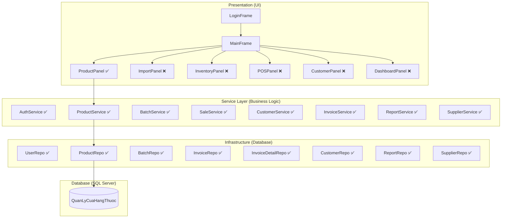

# 📋 Apothecary Pro — Tổng Kết Dự Án
> **Hệ thống Quản lý Cửa hàng Thuốc** | Java Swing + SQL Server  
> Cập nhật: 22/03/2026

---

## 🏗️ Kiến Trúc Tổng Quan



---

## 📊 Database Schema — 8 bảng

| # | Bảng | Mô tả | Trạng thái |
|---|------|-------|:----------:|
| 1 | `NguoiDung` | Tài khoản (Admin/NhanVien) | ✅ Có data |
| 2 | `SanPham` | Sản phẩm thuốc | ✅ 50 SP |
| 3 | `LoHang` | Lô hàng (số lô, HSD, SL tồn, giá nhập) | ✅ Có data seed |
| 4 | `KhachHang` | Khách hàng (SĐT unique) | ✅ Có data seed |
| 5 | `HoaDon` | Hóa đơn bán hàng | ✅ Có data seed |
| 6 | `ChiTietHoaDon` | Chi tiết HĐ (liên kết lô → FEFO) | ✅ Có data seed |
| 7 | `PhieuNhap` | Phiếu nhập hàng | ✅ Có data seed |
| 8 | `NhaCungCap` | Nhà cung cấp | ✅ Có data seed |

> **Bổ sung:** View `vw_TonKhoTheoSanPham`, Stored Procedures, Indexes đã tạo.

---

## 🧩 Domain Entities — 8 entity

| Entity | File | Thuộc tính chính |
|--------|------|-----------------|
| `User` | ✅ | MaND, TenDangNhap, MatKhau, HoTen, VaiTro |
| `Product` | ✅ | MaSP, TenSP, DonViTinh, GiaBan, GiaBanSi, TrangThai, TongTonKho |
| `Batch` | ✅ | MaLo, MaSP, SoLo, HanSuDung, SoLuong, GiaNhap, MaPN |
| `Customer` | ✅ | MaKH, SoDT, TenKH |
| `Invoice` | ✅ | MaHD, MaKH, MaND, NgayBan, TongTien, PhuongThucTT |
| `InvoiceDetail` | ✅ | MaCTHD, MaHD, MaLo, MaSP, SoLuong, DonGia, ThanhTien |
| `ImportReceipt` | ✅ | MaPN, MaND, MaNCC, NgayNhap, TongTien, GhiChu |
| `Supplier` | ✅ | MaNCC, TenNCC, SoDT, DiaChi, Email, TrangThai |

> **DTOs:** `CartItem`, `RevenueDTO`, `TopSellingDTO`, `TopCustomerDTO` — ✅ đã có

---

## 🔧 Service + DAO Layer

| Service | Interface | Impl | DAO | Các hàm chính |
|---------|:---------:|:----:|:---:|--------------|
| **Auth** | ✅ | ✅ | ✅ | `login(username, password)` |
| **Product** | ✅ | ✅ | ✅ | `getAll`, `insert`, `update`, `softDelete`, `getPagedWithStock`, `countFiltered`, `bulkUpdateStatus` |
| **Batch** | ✅ | ✅ | ✅ | `importBatch`, `getByProductId`, `getAllWithProduct` |
| **Sale** | ✅ | ✅ | ✅ | `checkout(cart, soDT, tenKH, phuongThucTT)` — FEFO logic |
| **Customer** | ✅ | ✅ | ✅ | `findOrCreate`, `getAll`, `search` |
| **Invoice** | ✅ | ✅ | ✅ | `getAll`, `getDetailsByInvoiceId` |
| **Report** | ✅ | ✅ | ✅ | `getRevenue`, `getExpiringBatches`, `getTopSelling`, `getTopCustomers` |
| **Supplier** | ✅ | ✅ | ✅ | CRUD nhà cung cấp |

> **Dependency Injection:** Qua `ServiceFactory` (DI Container đơn giản) — ✅ hoàn chỉnh

---

## 🖥️ Giao Diện (Presentation Layer)

### ✅ ĐÃ HOÀN THÀNH

#### 1. Login (`LoginFrame.java`)
- [x] Giao diện đăng nhập username/password
- [x] Phân quyền Admin / Nhân viên
- [x] Session management

#### 2. Main Frame (`MainFrame.java`)
- [x] Sidebar dark navy + menu buttons
- [x] CardLayout chuyển tab
- [x] Hiển thị user info + vai trò
- [x] Phân quyền: ẩn Dashboard/Nhập Kho/Tồn Kho nếu Nhân viên
- [x] Maximized window mặc định
- [x] Đăng xuất

#### 3. Quản Lý Sản Phẩm (`ProductPanel.java`) ⭐
- [x] CRUD sản phẩm (Thêm / Cập nhật / Soft Delete)
- [x] Server-side Pagination (`OFFSET/FETCH NEXT`, 20 SP/trang)
- [x] Server-side Sorting (click header → DAO switch-case whitelist)
- [x] Tie-breaker sort (`MaSP ASC`) chống lặp/mất dòng
- [x] Debounce search (400ms)
- [x] Filter theo trạng thái (Admin: Tất cả/Đang bán/Ngừng bán)
- [x] Auto-calc giá sỉ (nhập % → tính giá)
- [x] Gmail-style Bulk Action:
  - [x] Checkbox column (col 0, Boolean.class)
  - [x] Custom header checkbox renderer (click = toggle all)
  - [x] Bulk buttons ẩn mặc định, hiện khi ≥2 tick
  - [x] TableModelListener đếm checkbox
  - [x] Cross-page ID memory (`globalSelectedIds`)
  - [x] Ngừng bán / Khôi phục hàng loạt
- [x] Transaction safety (setAutoCommit/commit/rollback)
- [x] SQL Injection prevention (Whitelist column mapping)
- [x] Anti-spam click (isLoading flag + header lock)
- [x] Database indexes cho sort columns
- [x] Dynamic row height (trải full viewport)
- [x] Phân quyền Admin/NV trên form

### ❌ CHƯA LÀM (Placeholder)

#### 4. Nhập Kho (`ImportPanel`) — **Ưu tiên 1**
- [ ] Form nhập phiếu nhập (ComboBox NCC, ghi chú)
- [ ] Bảng chi tiết lô: ComboBox SP, Số lô, HSD (Date Picker), SL, Giá nhập
- [ ] Thêm/xóa dòng lô linh hoạt
- [ ] Validate: SP trùng lô + HSD → gộp SL
- [ ] Tạo PhieuNhap → N LoHang (Transaction)
- [ ] Tự cập nhật tồn kho
- [ ] Lịch sử phiếu nhập (JTable + filter theo ngày)
- [ ] Xem chi tiết phiếu nhập (Dialog)

#### 5. Tồn Kho (`InventoryPanel`) — **Ưu tiên 2**
- [ ] JTable tồn kho chi tiết theo lô & HSD
- [ ] Cảnh báo sắp hết hạn (highlight đỏ: < 30 ngày)
- [ ] Cảnh báo đã hết hạn (highlight đậm đỏ)
- [ ] Filter theo: SP, trạng thái, sắp hết hạn
- [ ] Tổng tồn kho theo SP
- [ ] Export báo cáo (optional)

#### 6. Bán Hàng — POS (`POSPanel`) — **Ưu tiên 3**
- [ ] Tìm thuốc nhanh (search/autocomplete)
- [ ] Giỏ hàng: thêm/xóa/sửa SL
- [ ] Logic FEFO: tự động trừ lô sắp hết hạn trước
- [ ] Nhập SĐT khách hàng (tạo mới nếu chưa có)
- [ ] Chọn phương thức thanh toán
- [ ] Thanh toán → tạo HoaDon + ChiTietHoaDon (Transaction)
- [ ] Trừ tồn kho lô tương ứng
- [ ] In hóa đơn (optional)
- [ ] Phân biệt giá lẻ / giá sỉ

#### 7. Khách Hàng (`CustomerPanel`) — **Ưu tiên 4**
- [ ] Danh sách khách hàng (JTable)
- [ ] Tìm kiếm theo SĐT / Tên
- [ ] Click → xem lịch sử mua hàng (Dialog)
- [ ] CRUD khách hàng

#### 8. Dashboard (`DashboardPanel`) — **Ưu tiên 5**
- [ ] 3 Card thống kê: Doanh thu Hôm nay / Tháng / Năm
- [ ] JTable: Top sản phẩm bán chạy
- [ ] JTable: Top khách hàng VIP
- [ ] JTable: Cảnh báo lô sắp hết hạn
- [ ] Biểu đồ doanh thu (optional)

---

## 📁 Cấu Trúc Thư Mục

```
eProject-StoreBanThuoc/
├── database/                          # SQL Scripts
│   ├── 01_create_database.sql         ✅ Schema 8 bảng
│   ├── 02_seed_data.sql               ✅ Data mẫu (25 SP + NCC + KH + HĐ)
│   ├── 03_stored_procedures.sql       ✅ SP + View
│   ├── 04_verify_data.sql             ✅ Script kiểm tra
│   ├── 05_migration_financial_fix.sql ✅ Fix tài chính
│   ├── 06_edge_case_fixes.sql         ✅ Fix edge case
│   ├── 07_unique_lot_constraint.sql   ✅ Constraint lô hàng
│   ├── 08_phieunhap_giasi_fix.sql     ✅ Fix phiếu nhập + giá sỉ
│   ├── 09_nha_cung_cap.sql            ✅ Bảng NCC
│   ├── 09_seed_25_products.sql        ✅ Thêm 25 SP
│   └── 10_index_sort_columns.sql      ✅ Index cho sort
│
├── src/main/java/
│   ├── App.java                       ✅ Entry point
│   ├── common/
│   │   ├── AppColors.java             ✅ Design tokens
│   │   ├── DatabaseHelper.java        ✅ Connection pool (HikariCP)
│   │   ├── ServiceFactory.java        ✅ DI Container
│   │   └── Session.java               ✅ Session management
│   │
│   ├── domain/
│   │   ├── entity/    (8 files)       ✅ Tất cả entity
│   │   ├── dto/       (4 files)       ✅ CartItem, Revenue, TopSelling, TopCustomer
│   │   └── repository/ (8 interfaces) ✅ Tất cả interfaces
│   │
│   ├── infrastructure/
│   │   └── repository/ (8 impl)       ✅ Tất cả DAO impl
│   │
│   ├── service/
│   │   ├── (8 interfaces)             ✅ Tất cả service interfaces
│   │   └── impl/ (8 impl)            ✅ Tất cả service impl
│   │
│   └── presentation/
│       ├── LoginFrame.java            ✅ Hoàn chỉnh
│       ├── MainFrame.java             ✅ Hoàn chỉnh
│       ├── ProductPanel.java          ✅ Hoàn chỉnh (975 dòng)
│       ├── panel/
│       │   ├── DashboardPanel.java    ❌ Placeholder
│       │   ├── POSPanel.java          ❌ Placeholder
│       │   ├── ImportPanel.java       ❌ Placeholder
│       │   ├── InventoryPanel.java    ❌ Placeholder
│       │   └── CustomerPanel.java     ❌ Placeholder
│       ├── dialog/
│       │   ├── ProductFormDialog.java ❌ Placeholder
│       │   └── InvoiceDetailDialog.java ❌ Placeholder
│       └── component/                 (empty)
│
└── pom.xml                            ✅ Maven (JDK 25, HikariCP, MSSQL JDBC)
```

---

## 📈 Tiến Độ Tổng Thể

```
Backend (Service + DAO + Entity):  ████████████████████ 100%
Database (Schema + Seed + Index):  ████████████████████ 100%
UI — Sản Phẩm:                    ████████████████████ 100%
UI — Nhập Kho:                    ░░░░░░░░░░░░░░░░░░░░   0%
UI — Tồn Kho:                     ░░░░░░░░░░░░░░░░░░░░   0%
UI — Bán Hàng (POS):              ░░░░░░░░░░░░░░░░░░░░   0%
UI — Khách Hàng:                   ░░░░░░░░░░░░░░░░░░░░   0%
UI — Dashboard:                    ░░░░░░░░░░░░░░░░░░░░   0%
─────────────────────────────────────────────────────────
TỔNG:                              ████████░░░░░░░░░░░░  ~35%
```

---

## 🎯 Thứ Tự Phát Triển Tiếp Theo

| # | Module | Lý do ưu tiên | Độ phức tạp |
|---|--------|--------------|:-----------:|
| 1 | **📦 Nhập Kho** | Phải có hàng mới bán được | ⭐⭐⭐ |
| 2 | **📋 Tồn Kho** | Xem hàng đã nhập, cảnh báo HSD | ⭐⭐ |
| 3 | **🛒 Bán Hàng (POS)** | Core business — flow chính | ⭐⭐⭐⭐ |
| 4 | **👤 Khách Hàng** | Quản lý khách + lịch sử mua | ⭐⭐ |
| 5 | **📊 Dashboard** | Thống kê, chỉ cần sau khi có data bán | ⭐⭐⭐ |

> [!IMPORTANT]
> **Flow logic:** Nhập Kho → Tồn Kho → Bán Hàng → Khách Hàng → Dashboard  
> Không có hàng trong kho thì không bán được!

---

## 🔒 Kỹ Thuật Nổi Bật Đã Áp Dụng

| Kỹ thuật | Áp dụng tại |
|----------|------------|
| Server-side Pagination | ProductPanel → DAO (`OFFSET/FETCH`) |
| Server-side Sorting | ProductPanel → DAO (Switch-case whitelist) |
| SQL Injection Prevention | `mapSortColumn()`, `PreparedStatement IN(?,?)` |
| Transaction Safety | `bulkUpdateStatus()` — `setAutoCommit(false)/commit/rollback` |
| Connection Pooling | `DatabaseHelper` — HikariCP |
| Dependency Injection | `ServiceFactory` — Constructor Injection |
| Anti-Spam Click | `isLoading` flag + header lock |
| Gmail Bulk Action | Custom header renderer + TableModelListener |
| Cross-page State | `HashSet<Integer> globalSelectedIds` |
| FEFO Logic | `SaleServiceImpl.checkout()` — trừ lô sắp hết hạn trước |
| Debounce Search | `Timer 400ms` — chống gọi DB liên tục |
| Database Indexing | Indexes cho sort columns + FEFO + FK lookups |
