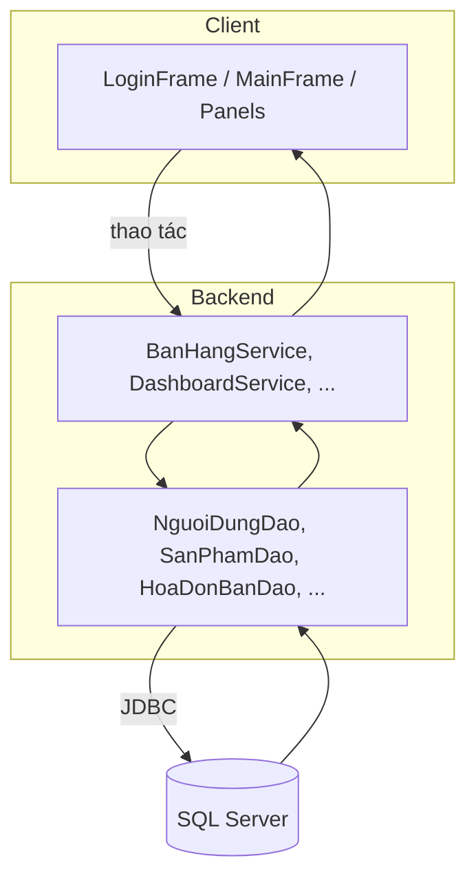
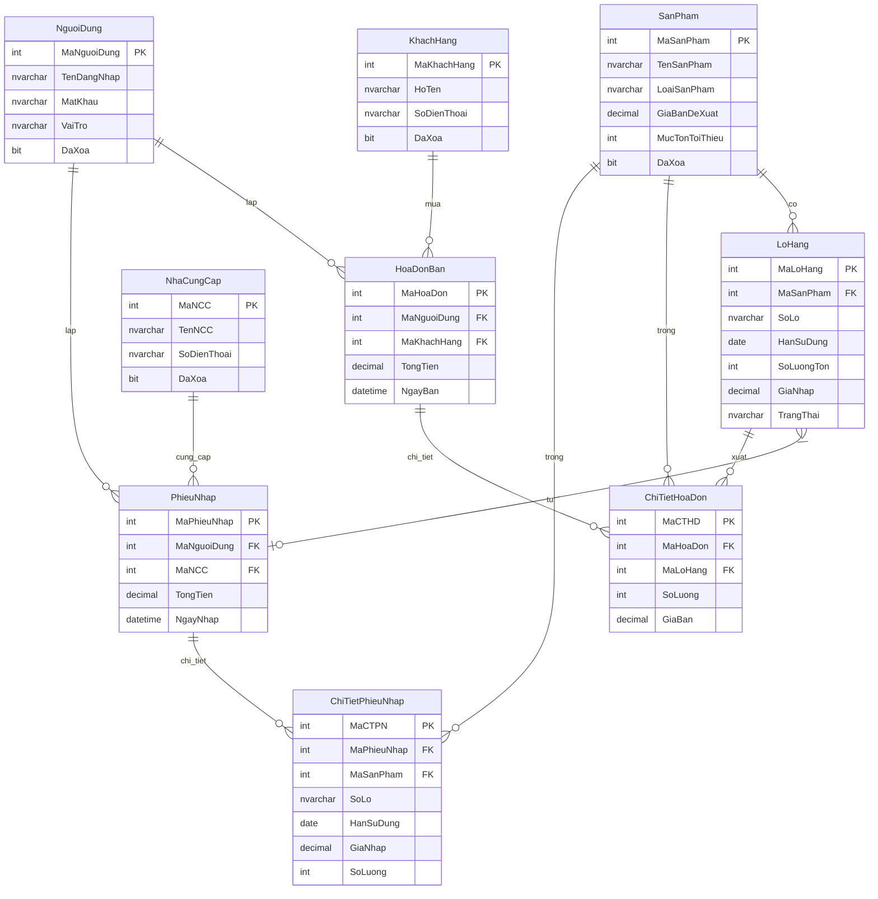
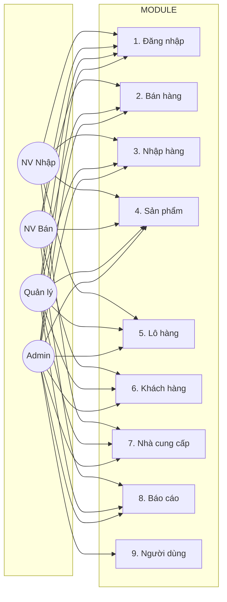
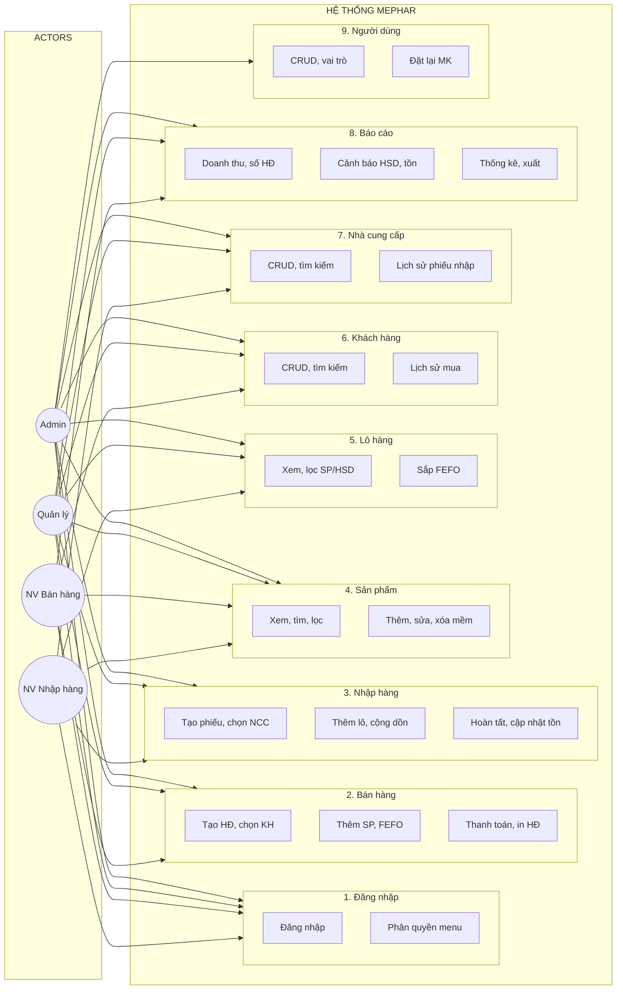
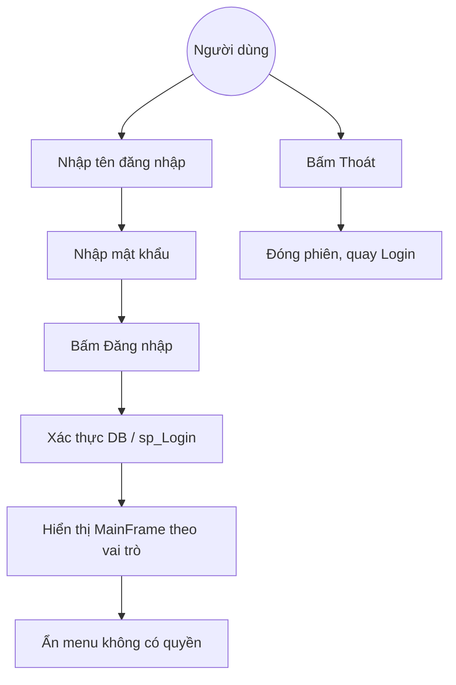
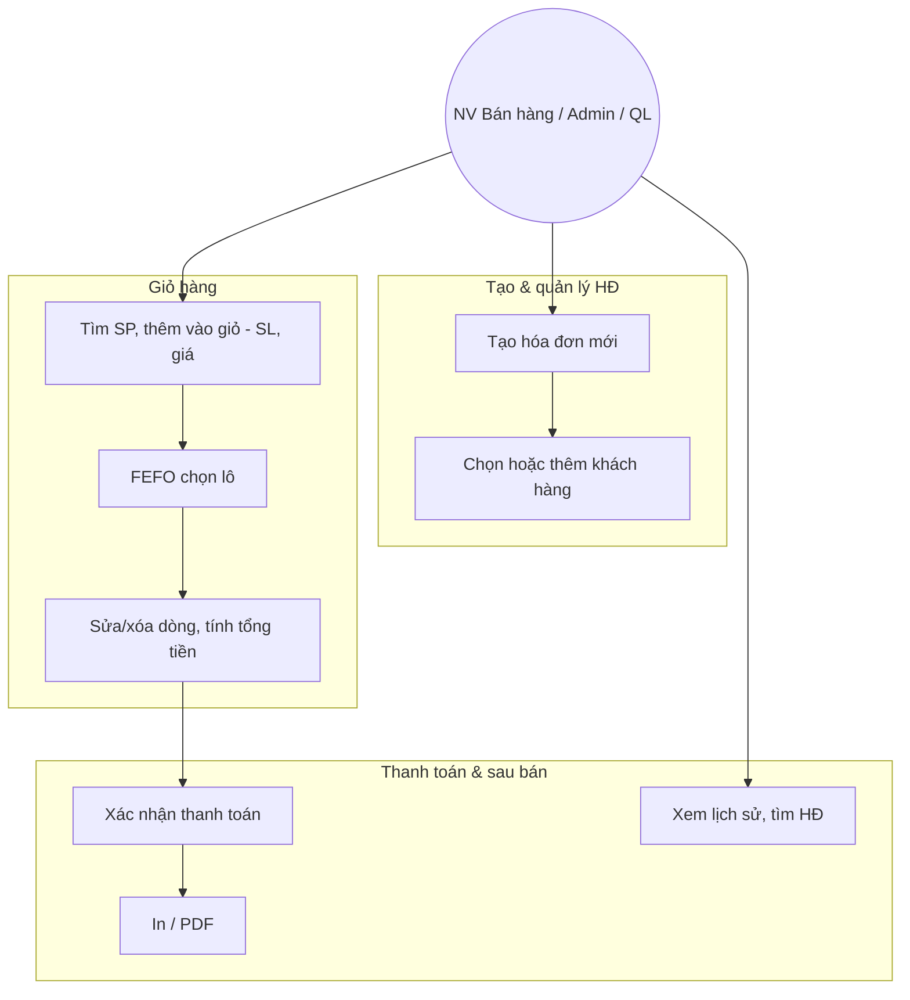
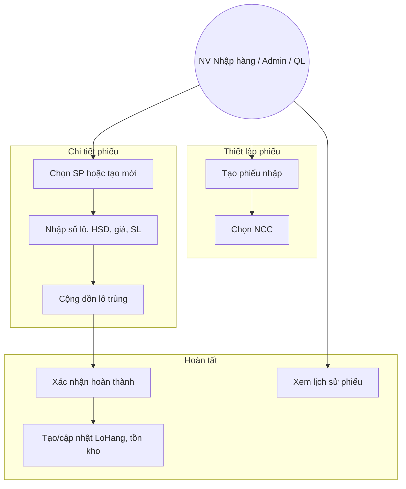

# MEPHAR — Cửa Hàng Thuốc

> Ứng dụng desktop quản lý bán hàng cho nhà thuốc: đăng nhập phân quyền, quản lý sản phẩm & lô hàng (FEFO), hóa đơn bán hàng, nhập hàng, khách hàng, nhà cung cấp và báo cáo thống kê.  
> **"Nhanh — Nhẹ — Dễ dùng"** · Java Swing · SQL Server · FlatLaf

---

## Mục lục

1. [Tổng quan](#1-tổng-quan)
2. [Công nghệ & Cấu trúc](#2-công-nghệ--cấu-trúc)
3. [Cài đặt & Chạy](#3-cài-đặt--chạy)
4. [Cấu hình](#4-cấu-hình)
5. [Kiến trúc & Phân quyền](#5-kiến-trúc--phân-quyền)
6. [Chức năng chi tiết](#6-chức-năng-chi-tiết)
7. [Dữ liệu](#7-dữ-liệu)
8. [Use Case Diagrams](#8-use-case-diagrams)
9. [Bảo mật & Checklist](#9-bảo-mật--checklist)

---

## 1. Tổng quan

**MEPHAR (Cửa Hàng Thuốc)** là ứng dụng desktop quản lý bán hàng cho nhà thuốc nhỏ và vừa:

- **Đăng nhập & phân quyền:** Admin, Quản lý, Nhân viên bán hàng, Nhân viên nhập hàng.
- **Bán hàng theo FEFO:** Tạo hóa đơn, thêm sản phẩm (tự chọn lô hết hạn trước), thanh toán, in hóa đơn.
- **Nhập hàng:** Phiếu nhập, thêm lô (số lô, HSD, giá, số lượng), cộng dồn lô trùng, cập nhật tồn kho.
- **Quản lý:** Sản phẩm, lô hàng, khách hàng, nhà cung cấp, người dùng (Admin).
- **Báo cáo:** Doanh thu ngày/tháng, cảnh báo hết hạn & tồn kho thấp, top sản phẩm bán chạy.

### 1.1 Actor (vai trò)

| Actor | Mô tả |
|-------|--------|
| **Admin** | Toàn quyền; quản lý người dùng; tất cả module. |
| **Quản lý** | Toàn bộ nghiệp vụ & báo cáo; không quản lý người dùng. |
| **Nhân viên bán hàng** | Bán hàng, sản phẩm, khách hàng, xem báo cáo. |
| **Nhân viên nhập hàng** | Nhập hàng, lô hàng, sản phẩm, nhà cung cấp. |

---

## 2. Công nghệ & Cấu trúc

### 2.1 Tech Stack

| Thành phần | Công nghệ |
|------------|-----------|
| Giao diện | Java Swing, FlatLaf |
| Ngôn ngữ | Java 17 |
| Cơ sở dữ liệu | SQL Server |
| Kết nối DB | JDBC, HikariCP |
| Build | Maven |
| Biểu đồ | JFreeChart |

### 2.2 Cấu trúc thư mục

```
CuaHangThuoc/
├── pom.xml
├── README.md
├── src/main/
│   ├── java/
│   │   ├── app/           # LoginFrame, MainFrame
│   │   ├── panels/        # DashboardPanel, BanHangPanel, NhapHangPanel, ...
│   │   ├── dao/           # NguoiDungDao, SanPhamDao, HoaDonBanDao, ...
│   │   ├── entity/        # NguoiDung, SanPham, LoHang, HoaDonBan, ...
│   │   ├── service/       # BanHangService, DashboardService, ReportService, ...
│   │   ├── common/        # ConnectDB, AppConfig, ColorScheme, IconHelper
│   │   ├── components/    # TableModel, ProductDetailDialog, ...
│   │   └── utils/         # FormatUtils, PermissionManager
│   └── resources/
│       ├── application.properties
│       └── icons/
└── database/              # CuaHangThuoc_Batch.sql, seed, cleanup
```

---

## 3. Cài đặt & Chạy

### 3.1 Yêu cầu

- JDK 17+
- Maven 3.6+
- SQL Server (chạy script trong `database/`)

### 3.2 Chạy nhanh (IDE)

1. Mở project trong Eclipse / IntelliJ.
2. Chạy class **`app.LoginFrame`** (main class).

### 3.3 Chạy bằng Maven

```bash
cd CuaHangThuoc
mvn clean compile exec:java
```

Hoặc đóng gói rồi chạy JAR (nếu đã cấu hình `maven-jar-plugin` với main class):

```bash
mvn clean package
java -jar target/swing007-0.0.1-SNAPSHOT.jar
```

### 3.4 Chuẩn bị database

1. Tạo database (script trong `database/CuaHangThuoc_Batch.sql`).
2. Chạy toàn bộ script tạo bảng, view, trigger, index.
3. Cấu hình chuỗi kết nối trong `src/main/resources/application.properties` (xem [Cấu hình](#4-cấu-hình)).

---

## 4. Cấu hình

Cấu hình nằm trong **`src/main/resources/application.properties`**. Không commit mật khẩu thật lên Git.

| Thuộc tính | Ví dụ | Mô tả |
|------------|--------|--------|
| `db.url` | `jdbc:sqlserver://localhost:1433;databaseName=CuaHangThuoc_Batch;...` | JDBC URL |
| `db.user` | `sa` | User DB |
| `db.password` | *(để ngoài repo)* | Mật khẩu DB |
| `db.pool.maximumPoolSize` | `10` | HikariCP |
| `stock.warningThresholdDays` | `30` | Cảnh báo lô hết hạn (ngày) |
| `invoice.prefix` | `HD` | Tiền tố mã hóa đơn |

Có thể ghi đè bằng biến môi trường hoặc file cấu hình ngoài (tùy cách đọc trong `common.AppConfig`).

---

## 5. Kiến trúc & Phân quyền

### 5.1 Luồng tổng quát



- **UI:** Swing (FlatLaf); xác thực đầu vào, hiển thị dữ liệu, điều hướng theo quyền.
- **Service:** Nghiệp vụ (FEFO, tính tổng tiền, báo cáo).
- **DAO:** Truy vấn SQL, ánh xạ ResultSet → Entity.
- **DB:** Bảng NguoiDung, SanPham, LoHang, HoaDonBan, ChiTietHoaDon, PhieuNhap, ChiTietPhieuNhap, KhachHang, NhaCungCap.

### 5.2 Phân quyền (RBAC)

- **PermissionManager** (`utils.PermissionManager`): Map **action** (ví dụ `banhang`, `nhaphang`, `nguoidung`) → danh sách **Role** được phép.
- **Role:** `ADMIN`, `QUANLY`, `NHANVIEN` (khớp với giá trị VaiTro trong DB).
- **SidebarPanel:** Chỉ thêm menu nếu `PermissionManager.hasAccess(vaiTro, action)` = true → không if-else vai trò rải rác trong UI.
- Thêm chức năng mới: (1) Thêm `permissions.put("actionId", List.of(Role.ADMIN, ...))` trong `PermissionManager`; (2) Gọi `addMenuItemIfAllowed(..., "actionId", role)` trong SidebarPanel.

---

## 6. Chức năng chi tiết

### 6.1 Đăng nhập & Xác thực

| STT | Chức năng | Mô tả |
|-----|-----------|--------|
| UC-A1 | Đăng nhập | Nhập tên đăng nhập & mật khẩu; xác thực qua DB / sp_Login. |
| UC-A2 | Thoát đăng nhập | Đóng phiên, quay về Login. |
| UC-A3 | Phân quyền menu | Sidebar chỉ hiển thị mục theo vai trò. |
| UC-A4 | Chặn truy cập | Ẩn/chặn thao tác khi không có quyền. |

### 6.2 Bán hàng

| STT | Chức năng | Mô tả |
|-----|-----------|--------|
| UC-B1 | Tạo hóa đơn mới | Hóa đơn trống, gắn người bán, chọn khách hàng (tùy chọn), ghi chú. |
| UC-B2 | Chọn / thêm khách hàng | Chọn từ danh sách hoặc thêm mới từ màn bán. |
| UC-B3 | Tìm kiếm sản phẩm | Mã, tên, barcode; hiển thị kèm tồn kho. |
| UC-B4 | Thêm SP vào giỏ | Nhập số lượng, giá bán; hệ thống áp dụng FEFO (chọn lô hết hạn trước). |
| UC-B5 | Sửa / xóa dòng giỏ | Chỉnh số lượng, giá; xóa dòng; tự tính lại tổng tiền. |
| UC-B6 | Xác nhận thanh toán | Khóa hóa đơn, cập nhật TongTien. |
| UC-B7 | In / xuất PDF hóa đơn | Sau khi thanh toán. |
| UC-B8 | Xem / tìm lịch sử hóa đơn | Lọc theo ngày, khách hàng, số HĐ. |

### 6.3 Nhập hàng

| STT | Chức năng | Mô tả |
|-----|-----------|--------|
| UC-N1 | Tạo phiếu nhập | Chọn NCC, người nhập, ghi chú. |
| UC-N2 | Chọn / thêm NCC | Từ danh sách hoặc thêm mới. |
| UC-N3 | Chọn SP hoặc tạo mới | Có thể khôi phục SP đã xóa nếu trùng tên. |
| UC-N4 | Thêm dòng lô | Số lô, HSD, giá nhập, số lượng, đơn vị. |
| UC-N5 | Cộng dồn lô trùng | Cùng MaSP + SoLo + HanSuDung → cộng số lượng. |
| UC-N6 | Hoàn thành phiếu | Lưu phiếu + chi tiết; tạo/cập nhật LoHang; cập nhật tồn. |
| UC-N7 | Xem / tìm lịch sử phiếu nhập | Theo ngày, NCC. |

### 6.4 Sản phẩm

| STT | Chức năng | Mô tả |
|-----|-----------|--------|
| UC-S1 | Xem danh sách | Phân trang, cột: Mã, Tên, Đơn vị, Giá, Loại, Tồn, Hạn gần nhất. |
| UC-S2 | Tìm kiếm / lọc | Theo tên; lọc theo loại SP, loại hình bán; sắp xếp. |
| UC-S3 | Thêm / sửa / xóa mềm | CRUD; xóa mềm (DaXoa = 1), có thể khôi phục khi nhập trùng tên. |
| UC-S4 | Xem chi tiết | Thông tin cơ bản + tồn theo lô, HSD. |

### 6.5 Lô hàng

| STT | Chức năng | Mô tả |
|-----|-----------|--------|
| UC-L1 | Xem danh sách lô | Sản phẩm, Số lô, HSD, Tồn, Giá nhập, Trạng thái. |
| UC-L2 | Lọc / sắp xếp | Lọc theo SP; lọc sắp hết hạn; sắp FEFO. |
| UC-L3 | Xem chi tiết lô | Đầy đủ thông tin lô, phiếu nhập gốc. |

### 6.6 Khách hàng

| STT | Chức năng | Mô tả |
|-----|-----------|--------|
| UC-K1 | Xem / tìm kiếm | Danh sách; tìm theo tên, SĐT. |
| UC-K2 | Thêm / sửa / xóa mềm | CRUD. |
| UC-K3 | Xem lịch sử mua hàng | Danh sách hóa đơn của khách. |

### 6.7 Nhà cung cấp

| STT | Chức năng | Mô tả |
|-----|-----------|--------|
| UC-NC1 | Xem / tìm kiếm | Danh sách; tìm theo tên, SĐT. |
| UC-NC2 | Thêm / sửa / xóa mềm | CRUD. |
| UC-NC3 | Xem lịch sử phiếu nhập | Theo NCC. |

### 6.8 Báo cáo & Thống kê

| STT | Chức năng | Mô tả |
|-----|-----------|--------|
| UC-R1 | Doanh thu / số HĐ hôm nay | Tổng tiền & đếm HĐ trong ngày. |
| UC-R2 | Cảnh báo lô sắp hết hạn | Lô có HSD trong 30 ngày tới. |
| UC-R3 | Cảnh báo tồn kho thấp | SP có tổng tồn < MucTonToiThieu. |
| UC-R4 | Thống kê doanh thu tháng / Top SP bán chạy | Biểu đồ, bảng; xuất PDF/Excel (nếu có). |

### 6.9 Quản lý người dùng (Admin)

| STT | Chức năng | Mô tả |
|-----|-----------|--------|
| UC-U1 | Xem / tìm danh sách user | Không hiển thị mật khẩu. |
| UC-U2 | Thêm / sửa / xóa mềm | CRUD; gán vai trò; trigger DB chặn xóa Admin. |
| UC-U3 | Đặt lại mật khẩu / đổi MK | Admin đặt lại; user đổi MK (nếu có màn hình). |

---

## 7. Dữ liệu

### 7.1 Sơ đồ quan hệ (ER)



### 7.2 Bảng chính

| Bảng | Mô tả | Khóa chính |
|------|--------|------------|
| **NguoiDung** | Tài khoản, VaiTro (Admin/QuanLy/NhanVien), DaXoa. | MaNguoiDung |
| **SanPham** | Danh mục SP; LoaiSanPham (Thuoc, DuocMiPham, ...). | MaSanPham |
| **LoHang** | Lô: MaSanPham, SoLo, HanSuDung, SoLuongTon, GiaNhap, TrangThai. | MaLoHang |
| **HoaDonBan** | Header hóa đơn: MaNguoiDung, MaKhachHang, TongTien, NgayBan. | MaHoaDon |
| **ChiTietHoaDon** | Dòng bán: MaHoaDon, MaLoHang, SoLuong, GiaBan, ThanhTien (computed). | MaCTHD |
| **PhieuNhap** | Header phiếu nhập: MaNguoiDung, MaNCC, TongTien, NgayNhap. | MaPhieuNhap |
| **ChiTietPhieuNhap** | Dòng nhập: MaPhieuNhap, MaSanPham, SoLo, HanSuDung, GiaNhap, SoLuong. | MaCTPN |
| **KhachHang** | Họ tên, SĐT, Email, Địa chỉ, HoSoBenhAn. | MaKhachHang |
| **NhaCungCap** | Tên NCC, SĐT, Email, Địa chỉ. | MaNCC |

### 7.3 View & Stored Procedure

| Đối tượng | Mô tả |
|-----------|--------|
| **v_TonKhoSanPham** | Tổng tồn theo sản phẩm (SUM SoLuongTon từ LoHang). |
| **sp_Login** | Xác thực đăng nhập. |
| **sp_HoaDonBan_Create** | Tạo hóa đơn mới. |
| **sp_HoaDonBan_Sell_FEFO** | Bán hàng FEFO: trừ tồn lô, tạo ChiTietHoaDon. |
| **sp_PhieuNhap_Create** | Tạo phiếu nhập & lô hàng. |

---

## 8. Use Case Diagrams

GitHub hỗ trợ render Mermaid; sơ đồ sẽ hiển thị trực tiếp. Export PNG/SVG: dùng [Mermaid Live Editor](https://mermaid.live).

### 8.1 Tổng quan (Actor – Module)



### 8.2 Diagram tổng hợp 1 trang A4 (báo cáo)



**Chú thích:** FEFO = First Expired First Out; CRUD = Thêm, sửa, xóa (xóa mềm), xem.

### 8.3 Đăng nhập & Xác thực



### 8.4 Bán hàng



### 8.5 Nhập hàng



### 8.6 Sản phẩm · Lô hàng · Khách hàng · Nhà cung cấp

- **Sản phẩm:** Xem danh sách, phân trang, tìm/lọc/sắp xếp → Thêm, sửa, xóa mềm, xem chi tiết.
- **Lô hàng:** Xem danh sách, lọc theo SP / sắp hết hạn, sắp FEFO, xem chi tiết.
- **Khách hàng:** Xem, tìm kiếm, CRUD, xem lịch sử mua.
- **Nhà cung cấp:** Xem, tìm kiếm, CRUD, xem lịch sử phiếu nhập.

### 8.7 Báo cáo & Quản lý người dùng

- **Báo cáo:** Doanh thu/số HĐ ngày, cảnh báo HSD/tồn thấp, thống kê tháng, top SP, xuất file.
- **Quản lý người dùng (Admin):** Xem/tìm user, CRUD, gán vai trò, đặt lại/đổi mật khẩu; trigger DB chặn xóa Admin.

---

## 9. Bảo mật & Checklist

### 9.1 Bảo mật

- Không commit mật khẩu DB hay secret vào repo; dùng `application.properties` ngoài repo hoặc biến môi trường.
- Dùng HikariCP và prepared statements (tránh SQL injection).
- Nên hash mật khẩu (bcrypt/argon2) khi lưu và so sánh khi đăng nhập.

### 9.2 Checklist (người mới)

- [ ] Cài JDK 17+, Maven.
- [ ] Có SQL Server; chạy script trong `database/`.
- [ ] Cấu hình `application.properties` (db.url, db.user, db.password).
- [ ] Chạy `app.LoginFrame` từ IDE hoặc `mvn clean compile exec:java`.

---

*Tài liệu gộp từ README, báo cáo chức năng, dữ liệu và Use Case — xem trực tiếp trên GitHub.*
