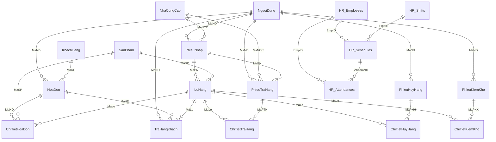

# Database Schema — QuanLyCuaHangThuoc

> **Server**: SQL Server (localhost)
> **Database**: `QuanLyCuaHangThuoc`
> **Tổng bảng**: 23 | **Tổng FK**: 33 | **Tổng Index**: 38
> **Cập nhật**: 28/03/2026

---

## Mục lục

1. [Module: Người Dùng & Hệ Thống](#1-module-người-dùng--hệ-thống)
2. [Module: Sản Phẩm & Kho](#2-module-sản-phẩm--kho)
3. [Module: Bán Hàng & Hóa Đơn](#3-module-bán-hàng--hóa-đơn)
4. [Module: Nhập Hàng](#4-module-nhập-hàng)
5. [Module: Trả Hàng & Hủy Hàng](#5-module-trả-hàng--hủy-hàng)
6. [Module: Kiểm Kho](#6-module-kiểm-kho)
7. [Module: HRM (Nhân Sự)](#7-module-hrm-nhân-sự)
8. [Sơ đồ quan hệ (ER Diagram)](#8-sơ-đồ-quan-hệ)

---

## 1. Module: Người Dùng & Hệ Thống

### 1.1 `NguoiDung` — Tài khoản đăng nhập

| Cột | Kiểu | Null | Mô tả |
|-----|------|------|-------|
| **MaND** | `int` IDENTITY | NO | PK — Mã người dùng |
| TenDangNhap | `nvarchar(50)` | NO | UNIQUE — Username |
| MatKhau | `nvarchar(255)` | NO | Mật khẩu (hash) |
| HoTen | `nvarchar(100)` | NO | Họ tên đầy đủ |
| VaiTro | `nvarchar(20)` | NO | `Admin` / `NhanVien` |
| TrangThai | `bit` | NO | 1 = Hoạt động, 0 = Khóa |
| NgayTao | `datetime` | NO | Ngày tạo tài khoản |
| DangOnline | `bit` | NO | Trạng thái online |

**Unique**: `UQ_NguoiDung_TenDangNhap(TenDangNhap)`

---

### 1.2 `SystemLogs` — Nhật ký hệ thống

| Cột | Kiểu | Null | Mô tả |
|-----|------|------|-------|
| **MaLog** | `int` IDENTITY | NO | PK |
| MaND | `int` | YES | FK → `NguoiDung.MaND` |
| TenUser | `nvarchar(100)` | NO | Tên user thực hiện |
| HanhDong | `nvarchar(50)` | NO | CRUD action |
| DoiTuong | `nvarchar(200)` | NO | Bảng/Module bị tác động |
| ChiTiet | `nvarchar(500)` | YES | Mô tả chi tiết |
| ThoiGian | `datetime` | NO | Timestamp |

---

## 2. Module: Sản Phẩm & Kho

### 2.1 `SanPham` — Sản phẩm (Thuốc)

| Cột | Kiểu | Null | Mô tả |
|-----|------|------|-------|
| **MaSP** | `int` IDENTITY | NO | PK |
| TenSP | `nvarchar(200)` | NO | Tên sản phẩm |
| DonViTinh | `nvarchar(50)` | NO | VD: Hộp, Vỉ, Chai |
| GiaBan | `decimal(18,0)` | NO | Giá bán lẻ (VNĐ) |
| GiaBanSi | `decimal(18,0)` | YES | Giá bán sỉ |
| TrangThai | `bit` | NO | 1 = Đang bán, 0 = Ngưng |
| NgayTao | `datetime` | NO | Ngày tạo |

**Indexes**: `IX_SanPham_TenSP`, `IX_SanPham_GiaBan`, `IX_SanPham_GiaBanSi`, `IX_SanPham_TrangThai`, `IX_SanPham_TrangThai_TenSP`

---

### 2.2 `LoHang` — Lô hàng (Batch)

| Cột | Kiểu | Null | Mô tả |
|-----|------|------|-------|
| **MaLo** | `int` IDENTITY | NO | PK |
| MaSP | `int` | NO | FK → `SanPham.MaSP` |
| SoLo | `nvarchar(50)` | NO | Mã lô (VD: LOT-001) |
| HanSuDung | `date` | NO | Ngày hết hạn |
| SoLuong | `int` | NO | Số lượng tồn kho |
| NgayNhap | `datetime` | NO | Ngày nhập lô |
| GiaNhap | `decimal(18,0)` | NO | Giá nhập (VNĐ) |
| MaPN | `int` | YES | FK → `PhieuNhap.MaPN` |

**Index**: `IX_LoHang_MaSP`

---

### 2.3 `NhaCungCap` — Nhà cung cấp

| Cột | Kiểu | Null | Mô tả |
|-----|------|------|-------|
| **MaNCC** | `int` IDENTITY | NO | PK |
| TenNCC | `nvarchar(200)` | NO | Tên NCC |
| SoDT | `varchar(15)` | YES | Số điện thoại |
| DiaChi | `nvarchar(300)` | YES | Địa chỉ |
| Email | `varchar(100)` | YES | Email |
| TrangThai | `bit` | NO | 1 = Hoạt động |
| NgayTao | `datetime` | NO | Ngày tạo |

---

### 2.4 `KhachHang` — Khách hàng

| Cột | Kiểu | Null | Mô tả |
|-----|------|------|-------|
| **MaKH** | `int` IDENTITY | NO | PK |
| SoDT | `varchar(15)` | NO | UNIQUE — SĐT khách |
| TenKH | `nvarchar(100)` | YES | Tên khách |
| GioiTinh | `nvarchar(10)` | YES | Nam/Nữ |
| NgayTao | `datetime` | NO | Ngày tạo |

**Unique**: `UQ_KhachHang_SoDT(SoDT)` | **Index**: `IX_KhachHang_SoDT`

---

## 3. Module: Bán Hàng & Hóa Đơn

### 3.1 `HoaDon` — Hóa đơn bán hàng

| Cột | Kiểu | Null | Mô tả |
|-----|------|------|-------|
| **MaHD** | `int` IDENTITY | NO | PK |
| MaKH | `int` | YES | FK → `KhachHang.MaKH` |
| MaND | `int` | NO | FK → `NguoiDung.MaND` (Nhân viên bán) |
| NgayBan | `datetime` | NO | Ngày/giờ bán |
| TongTien | `decimal(18,0)` | NO | Tổng tiền hóa đơn |
| PhuongThucTT | `nvarchar(20)` | NO | Tiền mặt / Chuyển khoản |
| TrangThai | `nvarchar(20)` | NO | Hoàn thành / Đã hủy |
| LyDoHuy | `nvarchar(500)` | YES | Lý do hủy (nếu hủy) |
| LoaiHD | `nvarchar(10)` | NO | `Le` / `Si` |
| MaHDGoc | `int` | YES | FK → `HoaDon.MaHD` (Self-ref: HD trả hàng) |

**Index**: `IX_HoaDon_NgayBan`

---

### 3.2 `ChiTietHoaDon` — Chi tiết hóa đơn

| Cột | Kiểu | Null | Mô tả |
|-----|------|------|-------|
| **MaCTHD** | `int` IDENTITY | NO | PK |
| MaHD | `int` | NO | FK → `HoaDon.MaHD` |
| MaLo | `int` | NO | FK → `LoHang.MaLo` |
| MaSP | `int` | NO | FK → `SanPham.MaSP` |
| SoLuong | `int` | NO | Số lượng mua |
| DonGia | `decimal(18,0)` | NO | Đơn giá bán |
| ThanhTien | `decimal(18,0)` | NO | = SoLuong x DonGia |
| GiaVon | `decimal(18,0)` | NO | Giá vốn (giá nhập) |

**Indexes**: `IX_CTHD_MaHD`, `IX_CTHD_MaSP`

---

### 3.3 `TraHangKhach` — Trả hàng từ khách

| Cột | Kiểu | Null | Mô tả |
|-----|------|------|-------|
| **MaTraKH** | `int` IDENTITY | NO | PK |
| MaHD | `int` | NO | FK → `HoaDon.MaHD` |
| MaCTHD | `int` | NO | FK → `ChiTietHoaDon.MaCTHD` |
| MaLo | `int` | NO | FK → `LoHang.MaLo` |
| MaSP | `int` | NO | FK → `SanPham.MaSP` |
| SoLuongTra | `int` | NO | Số lượng trả |
| DonGia | `decimal(18,2)` | NO | Đơn giá hoàn |
| TienHoan | `decimal(18,2)` | NO | Tiền hoàn khách |
| LyDo | `nvarchar(500)` | YES | Lý do trả |
| MaND | `int` | NO | FK → `NguoiDung.MaND` |
| NgayTra | `datetime` | YES | Ngày trả |

---

## 4. Module: Nhập Hàng

### 4.1 `PhieuNhap` — Phiếu nhập hàng

| Cột | Kiểu | Null | Mô tả |
|-----|------|------|-------|
| **MaPN** | `int` IDENTITY | NO | PK |
| MaND | `int` | NO | FK → `NguoiDung.MaND` |
| MaNCC | `int` | YES | FK → `NhaCungCap.MaNCC` |
| NgayNhap | `datetime` | NO | Ngày nhập |
| TongTien | `decimal(18,0)` | NO | Tổng tiền nhập |
| GhiChu | `nvarchar(500)` | YES | Ghi chú |

**Index**: `IX_PhieuNhap_NgayNhap`

---

## 5. Module: Trả Hàng & Hủy Hàng

### 5.1 `PhieuTraHang` — Phiếu trả hàng NCC

| Cột | Kiểu | Null | Mô tả |
|-----|------|------|-------|
| **MaPTH** | `int` IDENTITY | NO | PK |
| MaPN | `int` | NO | FK → `PhieuNhap.MaPN` |
| MaNCC | `int` | NO | FK → `NhaCungCap.MaNCC` |
| MaND | `int` | NO | FK → `NguoiDung.MaND` |
| NgayTra | `datetime` | YES | Ngày trả |
| TongTien | `decimal(18,0)` | YES | Tổng tiền trả |
| TrangThai | `nvarchar(30)` | YES | Trạng thái |
| GhiChu | `nvarchar(500)` | YES | Ghi chú |

### 5.2 `ChiTietTraHang` — Chi tiết trả hàng NCC

| Cột | Kiểu | Null | Mô tả |
|-----|------|------|-------|
| **MaCTTH** | `int` IDENTITY | NO | PK |
| MaPTH | `int` | NO | FK → `PhieuTraHang.MaPTH` |
| MaLo | `int` | NO | FK → `LoHang.MaLo` |
| MaSP | `int` | NO | FK → `SanPham.MaSP` |
| SoLuongTra | `int` | NO | Số lượng trả |
| DonGia | `decimal(18,0)` | NO | Đơn giá |
| ThanhTien | `decimal(18,0)` | NO | Thành tiền |
| LyDoTra | `nvarchar(200)` | YES | Lý do trả |

### 5.3 `TraHangNCC` — Trả hàng NCC (trực tiếp)

| Cột | Kiểu | Null | Mô tả |
|-----|------|------|-------|
| **MaTra** | `int` IDENTITY | NO | PK |
| MaLo | `int` | NO | FK → `LoHang.MaLo` |
| MaSP | `int` | NO | Mã sản phẩm |
| SoLuongTra | `int` | NO | Số lượng trả |
| GiaNhapLo | `decimal(18,0)` | YES | Giá nhập lô |
| TongTienHoan | `decimal(18,0)` | YES | Tổng tiền hoàn |
| HinhThucHoan | `nvarchar(50)` | YES | Hình thức hoàn tiền |
| LyDo | `nvarchar(500)` | YES | Lý do trả |
| MaND | `int` | NO | FK → `NguoiDung.MaND` |
| NgayTra | `datetime` | YES | Ngày trả |
| TongThietHai | `decimal(18,0)` | YES | Tổng thiệt hại |
| PhanLoaiLyDo | `nvarchar(100)` | YES | Phân loại lý do |
| ChiTietLyDo | `nvarchar(500)` | YES | Chi tiết lý do |
| TinhTrang | `nvarchar(100)` | YES | Tình trạng hàng |
| GhiChu | `nvarchar(500)` | YES | Ghi chú |

### 5.4 `HuyHang` — Hủy hàng

| Cột | Kiểu | Null | Mô tả |
|-----|------|------|-------|
| **MaHuy** | `int` IDENTITY | NO | PK |
| MaLo | `int` | NO | Mã lô hàng |
| MaSP | `int` | NO | Mã sản phẩm |
| SoLuongHuy | `int` | NO | Số lượng hủy |
| DonGiaVon | `decimal(18,0)` | YES | Giá vốn |
| TongThietHai | `decimal(18,0)` | YES | Tổng thiệt hại |
| PhanLoaiLyDo | `nvarchar(100)` | YES | Phân loại lý do |
| ChiTietLyDo | `nvarchar(500)` | NO | Chi tiết lý do hủy |
| MaND | `int` | NO | Người thực hiện |
| NgayHuy | `datetime` | YES | Ngày hủy |
| GiaNhapLo | `decimal(18,0)` | YES | Giá nhập gốc |
| TongTienHoan | `decimal(18,0)` | YES | Tổng tiền hoàn |
| HinhThucHoan | `nvarchar(50)` | YES | Hình thức hoàn |

### 5.5 `PhieuHuyHang` — Phiếu hủy hàng

| Cột | Kiểu | Null | Mô tả |
|-----|------|------|-------|
| **MaPHH** | `int` IDENTITY | NO | PK |
| MaND | `int` | NO | FK → `NguoiDung.MaND` |
| NgayHuy | `datetime` | YES | Ngày hủy |
| TongTonThat | `decimal(18,0)` | YES | Tổng tổn thất |
| LyDo | `nvarchar(500)` | YES | Lý do |
| GhiChu | `nvarchar(500)` | YES | Ghi chú |

### 5.6 `ChiTietHuyHang` — Chi tiết hủy hàng

| Cột | Kiểu | Null | Mô tả |
|-----|------|------|-------|
| **MaCTHH** | `int` IDENTITY | NO | PK |
| MaPHH | `int` | NO | FK → `PhieuHuyHang.MaPHH` |
| MaLo | `int` | NO | FK → `LoHang.MaLo` |
| MaSP | `int` | NO | FK → `SanPham.MaSP` |
| SoLuongHuy | `int` | NO | Số lượng hủy |
| DonGia | `decimal(18,0)` | NO | Đơn giá |
| ThanhTien | `decimal(18,0)` | NO | Thành tiền |
| LyDoHuy | `nvarchar(200)` | YES | Lý do hủy |

---

## 6. Module: Kiểm Kho

### 6.1 `PhieuKiemKho` — Phiếu kiểm kho

| Cột | Kiểu | Null | Mô tả |
|-----|------|------|-------|
| **MaPKK** | `int` IDENTITY | NO | PK |
| MaND | `int` | NO | FK → `NguoiDung.MaND` |
| NgayKiem | `datetime` | YES | Ngày kiểm |
| TrangThai | `nvarchar(30)` | YES | Trạng thái |
| GhiChu | `nvarchar(500)` | YES | Ghi chú |

### 6.2 `ChiTietKiemKho` — Chi tiết kiểm kho

| Cột | Kiểu | Null | Mô tả |
|-----|------|------|-------|
| **MaCTKK** | `int` IDENTITY | NO | PK |
| MaPKK | `int` | NO | FK → `PhieuKiemKho.MaPKK` |
| MaLo | `int` | NO | FK → `LoHang.MaLo` |
| MaSP | `int` | NO | FK → `SanPham.MaSP` |
| TonHeThong | `int` | NO | Tồn kho theo hệ thống |
| TonThucTe | `int` | NO | Tồn kho thực tế |
| ChenhLech | `int` | NO | = TonThucTe - TonHeThong |
| GhiChu | `nvarchar(200)` | YES | Ghi chú |

---

## 7. Module: HRM (Nhân Sự)

### 7.1 `HR_Config` — Cấu hình phép nghỉ

| Cột | Kiểu | Null | Mô tả |
|-----|------|------|-------|
| **ConfigID** | `int` IDENTITY | NO | PK |
| DefaultWeeklyLeave | `int` | NO | Số ngày nghỉ phép/tuần (mặc định: 1) |
| DefaultAnnualLeave | `int` | NO | Số ngày phép năm cơ bản (mặc định: 12) |

---

### 7.2 `HR_Employees` — Nhân viên

| Cột | Kiểu | Null | Mô tả |
|-----|------|------|-------|
| **EmpID** | `int` IDENTITY | NO | PK |
| FullName | `nvarchar(100)` | NO | Họ tên |
| PinCode | `varchar(10)` | NO | UNIQUE — Mã PIN chấm công |
| HourlyRate | `decimal(18,2)` | NO | Lương/giờ (VNĐ) |
| OvertimeRate | `decimal(18,2)` | NO | Lương tăng ca/giờ |
| WeeklyLeaveQuota | `int` | NO | *(legacy - không sử dụng)* |
| AnnualLeaveQuota | `int` | NO | *(legacy - không sử dụng)* |
| Status | `nvarchar(20)` | NO | `Đang làm` / `Đã nghỉ` |
| CreatedAt | `datetime` | NO | Ngày tạo |
| MaND | `int` | YES | FK → `NguoiDung.MaND` (link tài khoản) |
| Phone | `varchar(20)` | YES | Số điện thoại |
| HireDate | `date` | YES | Ngày vào làm |
| ResignDate | `date` | YES | Ngày nghỉ việc (NULL = đang làm) |

**Unique**: `UQ_HR_Employees_PinCode(PinCode)`

> [!NOTE]
> `WeeklyLeaveQuota` & `AnnualLeaveQuota` là cột legacy. Logic phép nghỉ hiện tại dùng `HR_Config` + tính động theo thâm niên (`HireDate`).
> **Công thức**: Phép Năm = `DefaultAnnualLeave` + `DATEDIFF(YEAR, HireDate, GETDATE())`

---

### 7.3 `HR_Shifts` — Ca làm việc

| Cột | Kiểu | Null | Mô tả |
|-----|------|------|-------|
| **ShiftID** | `int` IDENTITY | NO | PK |
| ShiftName | `nvarchar(50)` | NO | Tên ca |
| DefaultStartTime | `time` | NO | Giờ bắt đầu mặc định |
| DefaultEndTime | `time` | NO | Giờ kết thúc mặc định |

**Giá trị tham chiếu**:

| ID | ShiftName | Start | End | Loại |
|----|-----------|-------|-----|------|
| 1 | Ca Sáng | 06:00 | 14:00 | Ca Làm Việc |
| 2 | Ca Chiều | 14:00 | 22:00 | Ca Làm Việc |
| 3 | Nghỉ Phép Tuần | 00:00 | 00:00 | Nghỉ Phép Tuần |
| 4 | Nghỉ Phép Năm | 00:00 | 00:00 | Nghỉ Phép Năm |
| 5 | Nghỉ Không Lương | 00:00 | 00:00 | Không Lương |

---

### 7.4 `HR_Schedules` — Lịch xếp ca

| Cột | Kiểu | Null | Mô tả |
|-----|------|------|-------|
| **ScheduleID** | `int` IDENTITY | NO | PK |
| EmpID | `int` | NO | FK → `HR_Employees.EmpID` |
| ShiftID | `int` | NO | FK → `HR_Shifts.ShiftID` |
| WorkDate | `date` | NO | Ngày làm việc |
| ActualStart | `time` | NO | Giờ bắt đầu thực tế (snapshot từ Shift) |
| ActualEnd | `time` | NO | Giờ kết thúc thực tế (snapshot từ Shift) |
| CreatedAt | `datetime` | NO | Ngày tạo lịch |

**Unique**: `UQ_Schedule_EmpDateShift(EmpID, WorkDate, ShiftID)` — Không trùng lịch

---

### 7.5 `HR_Attendances` — Chấm công

| Cột | Kiểu | Null | Mô tả |
|-----|------|------|-------|
| **AttendanceID** | `int` IDENTITY | NO | PK |
| EmpID | `int` | NO | FK → `HR_Employees.EmpID` |
| ScheduleID | `int` | NO | FK → `HR_Schedules.ScheduleID` |
| ClockIn | `datetime` | NO | Giờ vào ca |
| ClockOut | `datetime` | YES | Giờ kết ca (NULL = đang trong ca) |
| LateReason | `nvarchar(255)` | YES | Lý do trễ / Ghi chú admin |
| TotalHours | `decimal(18,2)` | NO | Tổng giờ làm |
| DailyEarned | `decimal(18,2)` | NO | Lương ngày = TotalHours x SnapshotRate |
| SnapshotRate | `decimal(18,2)` | YES | Lương/giờ tại thời điểm (snapshot) |
| SnapshotStart | `time` | YES | Giờ bắt đầu ca (snapshot) |
| SnapshotEnd | `time` | YES | Giờ kết thúc ca (snapshot) |
| CreatedAt | `datetime` | NO | Ngày tạo record |

> [!IMPORTANT]
> Các cột `Snapshot*` lưu giá trị tại thời điểm chấm công. Nếu Admin sửa ca làm sau, dữ liệu lịch sử **không bị ảnh hưởng**.

---

## 8. Sơ đồ quan hệ

---

## Phụ lục: Danh sách Foreign Keys (33)

| FK Name | Bảng Con.Cột | Bảng Cha.Cột |
|---------|--------------|--------------|
| FK_CTHD_HoaDon | ChiTietHoaDon.MaHD | HoaDon.MaHD |
| FK_CTHD_LoHang | ChiTietHoaDon.MaLo | LoHang.MaLo |
| FK_CTHD_SanPham | ChiTietHoaDon.MaSP | SanPham.MaSP |
| FK_CTHH_PHH | ChiTietHuyHang.MaPHH | PhieuHuyHang.MaPHH |
| FK_CTHH_LH | ChiTietHuyHang.MaLo | LoHang.MaLo |
| FK_CTHH_SP | ChiTietHuyHang.MaSP | SanPham.MaSP |
| FK_CTKK_PKK | ChiTietKiemKho.MaPKK | PhieuKiemKho.MaPKK |
| FK_CTKK_LH | ChiTietKiemKho.MaLo | LoHang.MaLo |
| FK_CTKK_SP | ChiTietKiemKho.MaSP | SanPham.MaSP |
| FK_CTTH_PTH | ChiTietTraHang.MaPTH | PhieuTraHang.MaPTH |
| FK_CTTH_LH | ChiTietTraHang.MaLo | LoHang.MaLo |
| FK_CTTH_SP | ChiTietTraHang.MaSP | SanPham.MaSP |
| FK_HoaDon_NguoiDung | HoaDon.MaND | NguoiDung.MaND |
| FK_HoaDon_KhachHang | HoaDon.MaKH | KhachHang.MaKH |
| FK_HoaDon_HoaDonGoc | HoaDon.MaHDGoc | HoaDon.MaHD |
| FK_Att_Employee | HR_Attendances.EmpID | HR_Employees.EmpID |
| FK_Att_Schedule | HR_Attendances.ScheduleID | HR_Schedules.ScheduleID |
| FK_Schedule_Employee | HR_Schedules.EmpID | HR_Employees.EmpID |
| FK_Schedule_Shift | HR_Schedules.ShiftID | HR_Shifts.ShiftID |
| FK_LoHang_SanPham | LoHang.MaSP | SanPham.MaSP |
| FK_LoHang_PhieuNhap | LoHang.MaPN | PhieuNhap.MaPN |
| FK_PHH_ND | PhieuHuyHang.MaND | NguoiDung.MaND |
| FK_PKK_ND | PhieuKiemKho.MaND | NguoiDung.MaND |
| FK_PhieuNhap_NguoiDung | PhieuNhap.MaND | NguoiDung.MaND |
| FK_PhieuNhap_NhaCungCap | PhieuNhap.MaNCC | NhaCungCap.MaNCC |
| FK_PTH_ND | PhieuTraHang.MaND | NguoiDung.MaND |
| FK_PTH_NCC | PhieuTraHang.MaNCC | NhaCungCap.MaNCC |
| FK_PTH_PN | PhieuTraHang.MaPN | PhieuNhap.MaPN |
| FK_TraHangKhach_MaHD | TraHangKhach.MaHD | HoaDon.MaHD |
| FK_TraHangKhach_MaCTHD | TraHangKhach.MaCTHD | ChiTietHoaDon.MaCTHD |
| FK_TraHangKhach_MaLo | TraHangKhach.MaLo | LoHang.MaLo |
| FK_TraHangKhach_MaSP | TraHangKhach.MaSP | SanPham.MaSP |
| FK_TraHangKhach_MaND | TraHangKhach.MaND | NguoiDung.MaND |
