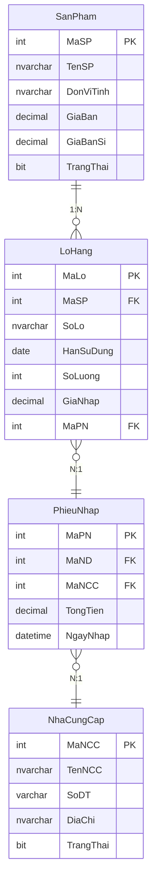

# 📋 Tài Liệu Chức Năng — Quản Lý Sản Phẩm & Nhập Kho

> **Dự án:** Apothecary Pro — Pharmacy Management System  
> **Kiến trúc:** MVP (Model-View-Presenter)  
> **Cập nhật:** 23/03/2026

---

## 📌 Mục Lục

- [Module 1: Quản Lý Sản Phẩm](#module-1-quản-lý-sản-phẩm)
- [Module 2: Nhập Kho](#module-2-nhập-kho)
- [Module 3: Chi Tiết Sản Phẩm (Dialog)](#module-3-chi-tiết-sản-phẩm-dialog)

---

## Module 1: Quản Lý Sản Phẩm

### 📁 Files liên quan

| File | Vai trò |
|------|---------|
| [ProductPanel.java](file:///d:/eproject/eProject-StoreBanThuoc/src/main/java/presentation/ProductPanel.java) | View — UI JTable + Form |
| [ProductPresenter.java](file:///d:/eproject/eProject-StoreBanThuoc/src/main/java/presentation/presenter/ProductPresenter.java) | Presenter — Business logic |
| [IProductView.java](file:///d:/eproject/eProject-StoreBanThuoc/src/main/java/presentation/view/IProductView.java) | Interface View ↔ Presenter |
| [IProductService.java](file:///d:/eproject/eProject-StoreBanThuoc/src/main/java/service/IProductService.java) | Interface Service layer |
| [ProductRepositoryImpl.java](file:///d:/eproject/eProject-StoreBanThuoc/src/main/java/infrastructure/repository/ProductRepositoryImpl.java) | Data Access Layer |

### 1.1 Hiển Thị Danh Sách Sản Phẩm

| Tính năng | Mô tả |
|-----------|-------|
| **JTable** | Hiển thị bảng SP với các cột: ☑, Mã SP, Tên SP, ĐVT, Giá Bán, Giá Sỉ, Tồn Kho, Trạng Thái |
| **Phân trang** | 20 dòng/trang, nút: ‹ Đầu ›, ‹ Trước ›, Page buttons, ‹ Sau ›, ‹ Cuối › |
| **Sort** | Click header cột → ASC/DESC (whitelist: MaSP, TenSP, DonViTinh, GiaBan, GiaBanSi, TongTonKho, TrangThai) |
| **Tìm kiếm** | TextField realtime → search theo TenSP (LIKE) |
| **Lọc trạng thái** | ComboBox: Tất cả / Đang bán / Ngừng bán |
| **Alt row colors** | Dòng chẵn trắng, dòng lẻ xám nhạt |

### 1.2 CRUD Sản Phẩm

#### ➕ Thêm Mới

```
Flow: Nhập form → Bấm "Thêm Mới" → Validate → INSERT SanPham → Refresh
```

| Validate | Chi tiết |
|----------|----------|
| Tên SP | Bắt buộc, không trống |
| ĐVT | Bắt buộc, không trống |
| Giá bán | Bắt buộc, số > 0 |
| Giá sỉ | Tùy chọn, phải ≤ Giá bán |
| Trùng | Kiểm tra `TenSP + DonViTinh` đã tồn tại chưa |

#### ✏️ Cập Nhật

```
Flow: Click dòng → Form fill data → Sửa → Bấm "Cập Nhật" → Confirm → UPDATE → Refresh
```

#### 🔴 Ngừng Bán / 🟢 Khôi Phục (Soft Delete)

```
Flow: Click dòng → Bấm "Ngừng Bán" / "Khôi Phục" → Confirm → UPDATE TrangThai → Refresh
```

- Nút tự đổi text + màu theo trạng thái hiện tại
- Ngừng bán = `TrangThai = 0` (KHÔNG xóa khỏi DB)

### 1.3 Checkbox & Bulk Actions

| Tính năng | Mô tả |
|-----------|-------|
| **Checkbox từng dòng** | Tick/bỏ tick riêng lẻ |
| **Header checkbox** | Toggle tất cả dòng trang hiện tại |
| **Global state** | Checkbox persist qua các trang (lưu trong `globalSelectedIds`) |
| **Bulk Ngừng Bán** | Xuất hiện khi ≥ 2 SP được chọn → Ngừng bán hàng loạt |
| **Bulk Khôi Phục** | Xuất hiện khi ≥ 2 SP được chọn → Khôi phục hàng loạt |

### 1.4 Auto-calc Giá Sỉ

```
Giá sỉ = Giá bán × (1 - Giảm sỉ% / 100)
```

- Nhập Giá bán + % giảm sỉ → Tự tính Giá sỉ
- Hỗ trợ % decimal (VD: 0,5% hay 2.3%)
- Field Giá sỉ: `readonly`, auto-calculated

### 1.5 Right-Click Context Menu

```
Right-click dòng SP → JPopupMenu → "Xem chi tiết lô hàng" → Mở ProductDetailDialog
```

> [!IMPORTANT]
> **TRAP #1 đã fix:** Dùng `table.rowAtPoint(e.getPoint())` + `setRowSelectionInterval()` để ép chọn đúng dòng khi right-click, tránh lỗi "trượt mục tiêu".

### 1.6 Phân Quyền

| Vai trò | Xem | Thêm/Sửa/Xóa | Bulk |
|---------|-----|---------------|------|
| Admin | ✅ | ✅ | ✅ |
| Nhân viên | ❌ (ẩn menu) | ❌ | ❌ |

---

## Module 2: Nhập Kho

### 📁 Files liên quan

| File | Vai trò |
|------|---------|
| [ImportPanel.java](file:///d:/eproject/eProject-StoreBanThuoc/src/main/java/presentation/panel/ImportPanel.java) | View — UI form + giỏ nhập |
| [ImportPresenter.java](file:///d:/eproject/eProject-StoreBanThuoc/src/main/java/presentation/presenter/ImportPresenter.java) | Presenter — Business logic |
| [IImportView.java](file:///d:/eproject/eProject-StoreBanThuoc/src/main/java/presentation/view/IImportView.java) | Interface View ↔ Presenter |
| [NhapKhoDAO.java](file:///d:/eproject/eProject-StoreBanThuoc/src/main/java/infrastructure/repository/NhapKhoDAO.java) | Data Access Layer |
| [ImportCartItem.java](file:///d:/eproject/eProject-StoreBanThuoc/src/main/java/domain/dto/ImportCartItem.java) | DTO giỏ nhập |

### 2.1 Layout Tổng Quan

```
┌──────────────────────────────────────────────────────────────────────┐
│ Nhập Kho                     Nhập thông tin sản phẩm, lô hàng...   │
├────────────────────────────┬─────────────────────────────────────────┤
│ ★ Thông Tin Sản Phẩm      │ ★ Thông Tin Lô Hàng                   │
│  Tên SP (auto-suggest)     │  Số lô: LOT-2026-001                  │
│  Đơn vị tính               │  Nhà cung cấp: [▼ DHG Pharma]         │
│  Giá bán (VNĐ)             │  Hạn sử dụng: 31/12/2027 (auto /)    │
│  Giảm sỉ (%) | Giá sỉ     │  Số lượng                              │
│                             │  Giá nhập (VNĐ)                       │
│                             │  [    Xác Nhận    ]                    │
├─────────────────────────────┴────────────────────────────────────────┤
│ Giỏ Nhập Kho                            [Xóa Dòng] [XÁC NHẬN NHẬP]│
│ # │ Tên SP │ ĐVT │ Số Lô │ Hạn SD │ SL │ Giá Nhập (VNĐ)          │
│ 1 │ Para   │ Viên│ LOT-1 │ 12/2027│ 500│             15,000        │
│ 2 │ Amo    │ Hộp │ LOT-2 │ 06/2026│ 200│             45,000        │
├──────────────────────────────────────────────────────────────────────┤
│                                        TỔNG TIỀN: 60,000 VNĐ       │
└──────────────────────────────────────────────────────────────────────┘
```

### 2.2 Auto-Suggest Tên Sản Phẩm

```
User gõ "par" → Popup gợi ý: Paracetamol 500mg, Paracetamol 650mg, ...
Click chọn → Auto-fill: Tên SP, ĐVT, Giá bán, % giảm sỉ, Giá sỉ
```

- Load từ `SanPham WHERE TrangThai = 1`
- Refresh sau mỗi lần nhập kho (bắt SP mới vừa tạo)
- SP mới hoàn toàn: gõ tay tất cả field

### 2.3 Nhà Cung Cấp

| Tính năng | Mô tả |
|-----------|-------|
| **Vị trí** | JComboBox trong phần "Thông Tin Lô Hàng", dưới field "Số lô" |
| **Dữ liệu** | Load từ `NhaCungCap WHERE TrangThai = 1 ORDER BY TenNCC` |
| **Mặc định** | `-- Chọn nhà cung cấp --` (MaNCC = -1) |
| **Validate** | Bắt buộc chọn NCC trước khi lưu phiếu nhập |
| **Lưu** | `PhieuNhap.MaNCC` = MaNCC được chọn |

### 2.4 Auto "/" cho Hạn Sử Dụng

```
User gõ: 3 1 1 2 2 0 2 7
Hiển thị: 31/12/2027
         ^^   ^^
    Auto insert "/" tại vị trí 2 và 5
```

- Chỉ cho nhập số và `/`
- Max 10 ký tự
- Format: `dd/MM/yyyy`

### 2.5 Giỏ Nhập (Cart)

| Tính năng | Mô tả |
|-----------|-------|
| **Thêm** | Bấm "Xác Nhận" → validate → thêm dòng vào cart |
| **Xóa** | Chọn dòng → "Xóa Dòng" |
| **Tổng tiền** | Auto-tính = Σ(Giá nhập) |
| **Giá nhập** | = Thành tiền luôn (không nhân SL) |
| **Dấu phẩy** | Auto format: 15,000 VNĐ |

### 2.6 Validation Khi Thêm Vào Giỏ

| Validate | Chi tiết |
|----------|----------|
| Tên SP | Không trống |
| ĐVT | Không trống |
| Giá bán | Số > 0 |
| Số lô | Không trống |
| Số lô trùng (cart) | Check trong giỏ hiện tại |
| Số lô trùng (DB) | `SELECT COUNT(1) FROM LoHang WHERE SoLo = ?` |
| HSD | Format dd/MM/yyyy |
| HSD quá hạn | HSD < ngày hiện tại → từ chối |
| Số lượng | Số nguyên > 0 |
| Giá nhập | Số > 0 |

> [!WARNING]
> **Chống trùng số lô 2 tầng:** Kiểm tra cả trong giỏ nhập lẫn trong DB. Mỗi số lô chỉ được nhập 1 lần duy nhất trong toàn hệ thống.

### 2.7 Lưu Phiếu Nhập (Transaction)

```
Bấm "Xác Nhận Nhập Hàng"
  → Confirm dialog (số dòng + tổng tiền)
  → Validate NCC đã chọn
  → BEGIN TRANSACTION
     ① INSERT PhieuNhap (MaND, MaNCC, TongTien=0)
     ② Loop từng dòng cart:
        a. TenSP tồn tại? → UPDATE GiaBan, GiaBanSi
        b. TenSP mới?     → INSERT SanPham → GET MaSP
        c. INSERT LoHang (MaSP, SoLo, HanSuDung, SoLuong, GiaNhap, MaPN)
     ③ UPDATE PhieuNhap SET TongTien = SUM(GiaNhap) FROM LoHang
  → COMMIT
  → Clear cart + refresh SP list
```

> [!IMPORTANT]
> **Hybrid Upsert:** Sản phẩm cùng tên + ĐVT → UPDATE giá. Sản phẩm mới → INSERT. Tất cả trong 1 transaction, rollback nếu lỗi.

### 2.8 Phân Quyền

| Vai trò | Xem form | Nhập kho |
|---------|----------|----------|
| Admin | ✅ | ✅ |
| Nhân viên | ❌ (ẩn menu) | ❌ |

---

## Module 3: Chi Tiết Sản Phẩm (Dialog)

### 📁 Files liên quan

| File | Vai trò |
|------|---------|
| [ProductDetailDialog.java](file:///d:/eproject/eProject-StoreBanThuoc/src/main/java/presentation/dialog/ProductDetailDialog.java) | JDialog hiển thị |
| [NhapKhoDAO.getBatchesByMaSP()](file:///d:/eproject/eProject-StoreBanThuoc/src/main/java/infrastructure/repository/NhapKhoDAO.java) | Query batches + JOIN NCC |
| [Batch.java](file:///d:/eproject/eProject-StoreBanThuoc/src/main/java/domain/entity/Batch.java) | Entity lô hàng (+ tenNCC transient) |

### 3.1 Cách Mở

```
ProductPanel → Right-click dòng SP → "Xem chi tiết lô hàng" → ProductDetailDialog(MaSP)
```

### 3.2 Layout

```
┌──────────────────────────────────────────────────────────────────────┐
│                        Chi tiết sản phẩm                            │
├──────────────────────────────────────────────────────────────────────┤
│  Mã SP: 52        Tên sản phẩm: Penicillin     Đơn vị tính: Viên   │
│  Giá bán lẻ: 1,500 VNĐ   Giá bán sỉ: 1,496 VNĐ   Tổng tồn: 2,100│
├──────────────────────────────────────────────────────────────────────┤
│ [✓] Chỉ hiện lô còn hàng                                           │
├─────┬──────────┬─────┬────┬───────────┬──────────────┬──────────────┤
│ STT │ Mã Lô    │ Số  │ SL │ Hạn SD    │ Nhà Cung Cấp │ Trạng Thái  │
│  1  │ LOT-001  │ 22  │500 │ 12/12/2026│ DHG Pharma   │    Tốt   🟢 │
│  2  │ LOT-002  │ 23  │ 50 │ 01/04/2026│ Pymepharco   │  Cận Date 🟡│
│  3  │ LOT-003  │ 25  │  0 │ 01/01/2025│ Traphaco     │  Hết HSD 🔴 │
├──────────────────────────────────────────────────────────────────────┤
│                                                          [ Đóng ]   │
└──────────────────────────────────────────────────────────────────────┘
```

### 3.3 Cột Bảng Lô Hàng

| Cột | Nguồn dữ liệu | Ghi chú |
|-----|----------------|---------|
| STT | Auto-increment | 1, 2, 3... |
| Mã Lô | `LoHang.SoLo` | Mã lô từ NCC (VD: LOT-2026-001) |
| Số Lô | `LoHang.MaLo` | ID auto-increment trong DB |
| Số Lượng | `LoHang.SoLuong` | Số lượng còn lại |
| Hạn Sử Dụng | `LoHang.HanSuDung` | Format dd/MM/yyyy |
| Nhà Cung Cấp | `NhaCungCap.TenNCC` | JOIN qua PhieuNhap.MaNCC |
| Trạng Thái | Calculated | Xem bảng dưới |

### 3.4 Logic Tính Trạng Thái (5 cấp, ưu tiên từ trên xuống)

| Thứ tự | Điều kiện | Trạng Thái | Màu nền | Màu chữ |
|--------|-----------|------------|---------|---------|
| 1 | `HanSuDung < today` | Hết HSD | 🔴 Đỏ nhạt `#F8D7DA` | `#721C24` |
| 2 | `HanSuDung ≤ today + 30 ngày` | Cận Date | 🟡 Vàng nhạt `#FFF3CD` | `#856D04` |
| 3 | `SoLuong = 0` | Hết hàng | 🔴 Đỏ nhạt `#F8D7DA` | `#721C24` |
| 4 | `SoLuong ≤ 10` | Sắp hết | 🟡 Vàng nhạt `#FFF3CD` | `#856D04` |
| 5 | Else | Tốt | 🟢 Xanh nhạt `#D4EDDA` | `#155724` |

> [!IMPORTANT]
> **TRAP #3 đã fix:** Dùng `java.time.LocalDate` cho MỌI phép so sánh ngày. Không dùng `java.util.Date` để tránh lỗi giờ-phút-giây.

### 3.5 Checkbox "Chỉ hiện lô còn hàng"

| Trạng thái | SQL/Logic |
|------------|-----------|
| ✅ Checked (mặc định) | Chỉ hiện lô có `SoLuong > 0` |
| ☐ Unchecked | Hiện TẤT CẢ lô (kể cả đã hết hàng) |

> [!TIP]
> **TRAP #2 đã fix:** Tránh "bãi rác lịch sử" — mặc định ẩn các lô hết hàng, nhân viên chỉ thấy lô đang active. Admin bỏ tick để xem lịch sử nhập kho.

### 3.6 SQL Query (JOIN NCC)

```sql
SELECT l.MaLo, l.MaSP, l.SoLo, l.HanSuDung, l.SoLuong, l.GiaNhap, l.MaPN,
       ISNULL(n.TenNCC, N'---') AS TenNCC
FROM LoHang l
LEFT JOIN PhieuNhap p ON l.MaPN = p.MaPN
LEFT JOIN NhaCungCap n ON p.MaNCC = n.MaNCC
WHERE l.MaSP = ?
ORDER BY l.HanSuDung ASC
```

---

## 🛡️ 3 Bẫy Đã Phòng Tránh

| # | Bẫy | Vị trí fix | Kỹ thuật |
|---|------|-----------|----------|
| 1 | Right-click trượt mục tiêu | [ProductPanel.java](file:///d:/eproject/eProject-StoreBanThuoc/src/main/java/presentation/ProductPanel.java) | `rowAtPoint()` + `setRowSelectionInterval()` |
| 2 | Bãi rác lịch sử | [ProductDetailDialog.java](file:///d:/eproject/eProject-StoreBanThuoc/src/main/java/presentation/dialog/ProductDetailDialog.java) | JCheckBox "Chỉ hiện lô còn hàng" (default ON) |
| 3 | Timezone bug | Toàn bộ | `java.time.LocalDate` only, NO `java.util.Date` |

---

## 🗄️ Database Schema Liên Quan



---

## 🔐 Phân Quyền Tổng Hợp

| Chức năng | Admin | Nhân viên |
|-----------|-------|-----------|
| Xem sản phẩm | ✅ | ❌ (ẩn menu) |
| Thêm/Sửa/Xóa SP | ✅ | ❌ |
| Bulk actions | ✅ | ❌ |
| Nhập kho | ✅ | ❌ (ẩn menu) |
| Xem chi tiết lô hàng | ✅ | ❌ |
| Nhà cung cấp | ✅ | ❌ (ẩn menu) |
