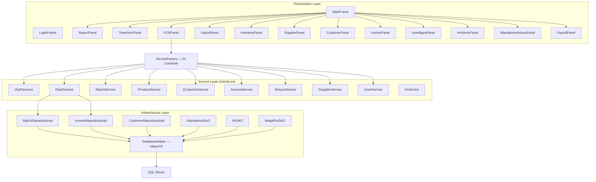
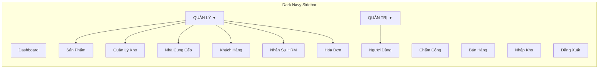
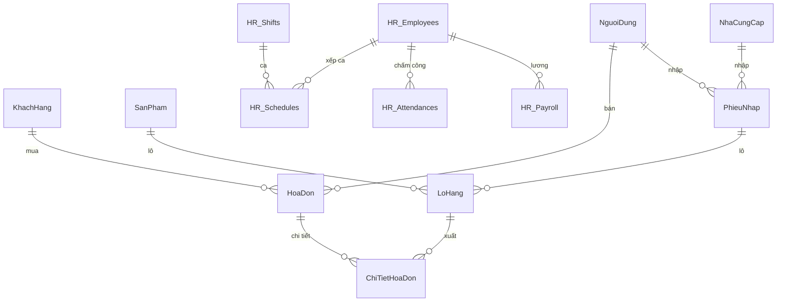

# 📋 Phân Tích Toàn Bộ Hệ Thống — Apothecary Pro

> **Dự án:** eProject-StoreBanThuoc (Pharmacy Management)  
> **Version:** 1.0  
> **Ngày phân tích:** 30/03/2026  
> **Tổng số Panel:** 13 (+ 2 placeholder chưa hoàn thiện)

---

## Mục Lục

1. [Tổng Quan Kiến Trúc](#1-tổng-quan-kiến-trúc)
2. [Technology Stack](#2-technology-stack)
3. [Sơ Đồ Module](#3-sơ-đồ-module)
4. [Module 0: LoginFrame — Đăng Nhập](#module-0-loginframe--đăng-nhập)
5. [Module 1: ReportPanel — Dashboard & Báo Cáo](#module-1-reportpanel--dashboard--báo-cáo)
6. [Module 2: TimeclockPanel — Máy Chấm Công](#module-2-timeclockpanel--máy-chấm-công)
7. [Module 3: POSPanel — Bán Hàng](#module-3-pospanel--bán-hàng)
8. [Module 4: ImportPanel — Nhập Kho](#module-4-importpanel--nhập-kho)
9. [Module 5: InventoryPanel — Quản Lý Kho](#module-5-inventorypanel--quản-lý-kho)
10. [Module 6: SupplierPanel — Nhà Cung Cấp](#module-6-supplierpanel--nhà-cung-cấp)
11. [Module 7: CustomerPanel — Khách Hàng](#module-7-customerpanel--khách-hàng)
12. [Module 8: InvoicePanel — Hóa Đơn](#module-8-invoicepanel--hóa-đơn)
13. [Module 9: UserManagementPanel — Người Dùng & Phân Quyền](#module-9-usermanagementpanel--người-dùng--phân-quyền)
14. [Module 10: HrAdminPanel — Nhân Sự (HRM)](#module-10-hradminpanel--nhân-sự-hrm)
15. [Module 11: AttendanceHistoryPanel — Lịch Sử Chấm Công](#module-11-attendancehistorypanel--lịch-sử-chấm-công)
16. [Module 12: PayrollPanel — Bảng Lương](#module-12-payrollpanel--bảng-lương)
17. [Session & RBAC](#session--rbac)
18. [Bảng Tổng Hợp](#bảng-tổng-hợp)

---

## 1. Tổng Quan Kiến Trúc



### Nguyên tắc thiết kế
- **Dependency Inversion**: GUI → Interface ← Impl. Wiring qua [ServiceFactory](file:///d:/eproject/eProject-StoreBanThuoc/src/main/java/common/ServiceFactory.java)
- **Single Responsibility**: Mỗi Panel = 1 module nghiệp vụ, mỗi Service = 1 nhóm logic
- **MVP Pattern**: ImportPanel dùng MVP (`IImportView` + `ImportPresenter`)
- **CardLayout**: MainFrame chuyển đổi panel qua sidebar navigation

---

## 2. Technology Stack

| Layer | Công nghệ | Mô tả |
|-------|-----------|-------|
| **Language** | Java 25 | Ngôn ngữ chính |
| **UI Framework** | Java Swing + FlatLaf | Look & Feel hiện đại |
| **Database** | Microsoft SQL Server | RDBMS |
| **Connection Pool** | HikariCP | Pool connection hiệu suất cao |
| **Build Tool** | Maven 3.x | Quản lý dependency |
| **PDF Engine** | OpenPDF (iText fork) | Xuất hóa đơn & QR PDF |
| **QR Payment** | VietQR API | Thanh toán qua mã QR ngân hàng |
| **Architecture** | Clean Architecture + DIP + MVP | Phân tầng rõ ràng |

---

## 3. Sơ Đồ Module



> Admin thấy tất cả. Nhân viên chỉ thấy: **Chấm Công**, **Bán Hàng**, **Sản Phẩm**, **Khách Hàng**, **Hóa Đơn**.

---

## Module 0: LoginFrame — Đăng Nhập

📄 [LoginFrame.java](file:///d:/eproject/eProject-StoreBanThuoc/src/main/java/presentation/LoginFrame.java) — **173 dòng**

### Chức năng
- Xác thực người dùng qua `IAuthService.login()`
- Phân quyền: Admin → Dashboard | Nhân viên → POS
- Session tracking: `Session.goOnline()` cập nhật `DangOnline = 1` trong DB

### Kỹ thuật nổi bật
| Tính năng | Chi tiết |
|-----------|----------|
| FlatLaf placeholder | `FlatClientProperties.PLACEHOLDER_TEXT` cho input fields |
| Hover effect | Đổi màu nút khi hover |
| Enter key login | `KeyAdapter` bắt VK_ENTER |
| Account lock check | Service kiểm tra `TrangThai = 0` → từ chối đăng nhập |

---

## Module 1: ReportPanel — Dashboard & Báo Cáo

📄 [ReportPanel.java](file:///d:/eproject/eProject-StoreBanThuoc/src/main/java/presentation/panel/ReportPanel.java) — **812 dòng** | 🔒 Admin only

### Chức năng
- **3 KPI Cards**: Doanh thu thuần, Tổng hóa đơn, Chi phí nhập kho, Lợi nhuận ròng
- **4 Bảng phân tích** (2×2 JSplitPane):
  - Top 10 SP bán chạy (Net Quantity)
  - Top Khách hàng VIP
  - Top 10 NCC nhập nhiều
  - Cảnh báo tồn kho (hết/sắp hết)
- **Filter**: Theo Quý + Năm
- **Export PDF**: Xuất báo cáo

### Kỹ thuật nổi bật
| Tính năng | Chi tiết |
|-----------|----------|
| No vertical scroll | Single viewport — tối ưu màn hình |
| Dynamic layout | 2×2 `JSplitPane` nested |
| Real-time KPI | Query tính toán tức thì khi đổi filter |
| Service layer | Qua `IReportService` → `ReportRepositoryImpl` |

---

## Module 2: TimeclockPanel — Máy Chấm Công

📄 [TimeclockPanel.java](file:///d:/eproject/eProject-StoreBanThuoc/src/main/java/presentation/panel/TimeclockPanel.java) — **339 dòng**

### Chức năng
- Đồng hồ số real-time (HH:mm:ss)
- Nhân viên nhập **PIN** để nhận ca / kết ca
- Tự động tính **giờ làm, đi trễ, tăng ca**

### Quy tắc nghiệp vụ
| Rule | Mô tả |
|------|-------|
| Nhận ca sớm | Chỉ cho phép 15 phút trước giờ bắt đầu ca |
| Không có ca | Không cho nhận ca nếu không có lịch hôm nay |
| Kết ca sớm | Cảnh báo + bắt điền lý do |
| Tăng ca | Sau giờ quy định → bắt điền lý do |
| Từ chối trùng | Đang trong ca → thông báo lỗi |
| Auto No-Show | Lúc khởi động app, tự đánh dấu NV không đến |
| Leave cancel | Khi clock-in, tự xóa schedule nghỉ phép cùng ngày |

### Kỹ thuật nổi bật
- `javax.swing.Timer(1000)` cho đồng hồ real-time
- PIN authentication qua `JPasswordField`
- Background thread auto no-show detection tại `MainFrame` startup

---

## Module 3: POSPanel — Bán Hàng

📄 [POSPanel.java](file:///d:/eproject/eProject-StoreBanThuoc/src/main/java/presentation/panel/POSPanel.java) — **1,439 dòng**

### Chức năng
- Split-pane: Bảng sản phẩm (trái) + Form giỏ hàng + thanh toán (phải)
- Tìm sản phẩm (debounce 250ms)
- Giỏ hàng: Thêm / Sửa SL / Xóa
- Customer auto-suggest (nhập SĐT → tự điền tên)
- Thanh toán: Tiền mặt / QR Code
- Hold Order (giữ đơn chờ) với badge
- Xuất hóa đơn PDF

### 6 Vấn Đề Chí Tử Đã Giải Quyết

| # | Vấn đề | Giải pháp | File |
|---|--------|-----------|------|
| 🔴 1 | Bán thuốc gần hạn trước | **FEFO Algorithm** — `ORDER BY HanSuDung ASC` | [SaleServiceImpl](file:///d:/eproject/eProject-StoreBanThuoc/src/main/java/service/impl/SaleServiceImpl.java) |
| 🔴 2 | Bán thuốc hết hạn/hết tồn | **Server-side Filter** — `HanSuDung > GETDATE() AND SoLuong > 0` | [POSPanel](file:///d:/eproject/eProject-StoreBanThuoc/src/main/java/presentation/panel/POSPanel.java#L625-L658) |
| 🔴 3 | Dữ liệu bất nhất khi lỗi | **Atomic Transaction** — `setAutoCommit(false)` + commit/rollback | [SaleServiceImpl](file:///d:/eproject/eProject-StoreBanThuoc/src/main/java/service/impl/SaleServiceImpl.java) |
| 🔴 4 | 2 NV bán cùng lúc (overselling) | **SQL UPDLOCK + ROWLOCK** | [BatchRepositoryImpl](file:///d:/eproject/eProject-StoreBanThuoc/src/main/java/infrastructure/repository/BatchRepositoryImpl.java#L82-L106) |
| 🔴 5 | Sai giá vốn khi tính lợi nhuận | **Cost Price Snapshotting** — lưu `GiaVon` từ lô vào `ChiTietHoaDon` | [InvoiceDetail](file:///d:/eproject/eProject-StoreBanThuoc/src/main/java/domain/entity/InvoiceDetail.java) |
| 🟡 6 | UI đơ khi thanh toán | **SwingWorker** — tách DB processing khỏi EDT | [POSPanel](file:///d:/eproject/eProject-StoreBanThuoc/src/main/java/presentation/panel/POSPanel.java#L1045-L1103) |

### Tính năng nâng cao
| Tính năng | Chi tiết |
|-----------|----------|
| QR Payment | VietQR API → Techcombank, checkbox xác nhận, xuất QR PDF |
| Hold Order | Giữ giỏ hàng tạm, badge đỏ, recall/delete |
| Debounce Search | 250ms `Timer` tránh spam DB |
| Customer Auto-Suggest | 300ms debounce, tự điền tên + giới tính |
| PDF Invoice | OpenPDF — header + info + detail table + total |

---

## Module 4: ImportPanel — Nhập Kho

📄 [ImportPanel.java](file:///d:/eproject/eProject-StoreBanThuoc/src/main/java/presentation/panel/ImportPanel.java) — **666 dòng** | 🔒 Admin only

### Chức năng
- **Section 1**: Thông tin sản phẩm (auto-suggest tên SP, ĐVT, giá bán)
- **Section 2**: Thông tin lô hàng (số lô, NCC combo, hạn SD, SL, giá nhập)
- **Section 3**: Giỏ nhập (JTable cart) + Xác nhận nhập hàng

### Kiến trúc MVP
```
ImportPanel (View)  ←→  ImportPresenter (Logic)  →  NhapKhoDAO (Data)
     ↕ IImportView
```
- Panel chỉ chứa UI, **không có logic**
- Mọi hành động delegate cho `ImportPresenter`

### Kỹ thuật nổi bật
| Tính năng | Chi tiết |
|-----------|----------|
| Auto-suggest SP | Debounce 250ms, popup gợi ý tên SP có sẵn |
| Sản phẩm mới | Nếu không tìm thấy → hiện `[Mới] Tên SP` → tự tạo SP mới khi nhập kho |
| Money format | `DocumentListener` tự thêm dấu phẩy phân cách hàng nghìn |
| DatePickerField | Custom component cho chọn ngày hạn sử dụng |
| NCC refresh | `componentShown()` tự reload NCC combo khi chuyển tab |

---

## Module 5: InventoryPanel — Quản Lý Kho

📄 [InventoryPanel.java](file:///d:/eproject/eProject-StoreBanThuoc/src/main/java/presentation/panel/InventoryPanel.java) — **1,406 dòng** | 🔒 Admin only

### Chức năng
- Xem toàn bộ lô hàng: Số Lô, Tên SP, ĐVT, SL, Giá Nhập, Hạn SD, Ngày Nhập, Người Nhập, NCC
- **CRUD** lô hàng: Thêm / Sửa / Xóa (có relationship check)
- Server-side **phân trang** (20 dòng/trang) + **Sorting** (click header)
- Filter theo keyword

### Kỹ thuật nổi bật
| Tính năng | Chi tiết |
|-----------|----------|
| Server-side sort | `SORT_SQL[]` map column index → SQL expression |
| `OFFSET…FETCH NEXT` | SQL Server pagination |
| Alt-row colors | Zebra striping cho readability |
| Dynamic row height | `adjustRowHeight()` — row height tự adapt theo viewport |
| JSplitPane layout | Form trái + Table phải, thống nhất UX toàn hệ thống |

---

## Module 6: SupplierPanel — Nhà Cung Cấp

📄 [SupplierPanel.java](file:///d:/eproject/eProject-StoreBanThuoc/src/main/java/presentation/panel/SupplierPanel.java) — **922 dòng** | 🔒 Admin only

### Chức năng
- CRUD Nhà Cung Cấp: Tên, SĐT, Địa chỉ, Email, Trạng thái
- **Soft Delete**: "Ngừng HT" → `TrangThai = 0` (không xóa vật lý)
- Filter: Keyword + Trạng thái (Hoạt động / Ngừng HT)
- **Xem Chi Tiết**: Popup dialog hiển thị lịch sử nhập kho của NCC
- Server-side pagination + Sorting

### Kỹ thuật nổi bật
| Tính năng | Chi tiết |
|-----------|----------|
| Duplicate name check | `isDuplicateName()` — case-insensitive |
| Email validation | Regex `^[\w.%+-]+@[\w.-]+\.[a-zA-Z]{2,}$` |
| Right-click popup | `JPopupMenu` → "Xem Chi Tiết" |
| Soft delete | Không bao giờ xóa vật lý → bảo toàn lịch sử nhập kho |
| Status color | Xanh = Hoạt động, Đỏ = Ngừng HT |

---

## Module 7: CustomerPanel — Khách Hàng

📄 [CustomerPanel.java](file:///d:/eproject/eProject-StoreBanThuoc/src/main/java/presentation/panel/CustomerPanel.java) — **1,005 dòng**

### Chức năng
- **Tab 1**: Khách đã đăng ký — CRUD + Phân trang + Search
- **Tab 2**: Khách vãng lai — Danh sách hóa đơn không có SĐT/tên
- **Lịch sử mua hàng**: Double-click hoặc right-click → popup chi tiết

### Kỹ thuật nổi bật
| Tính năng | Chi tiết |
|-----------|----------|
| Phone filter | `DocumentFilter` chỉ cho nhập số |
| Unique SĐT | Bắt exception `UQ_KhachHang_SoDT` → thông báo trùng rõ ràng |
| Tổng chi tiêu | Tự động từ DB (`TongMua`) — xanh lá + bold |
| Walk-in tab | Hiển thị HĐ `WHERE MaKH IS NULL` + tổng doanh thu |
| Debounce search | 300ms `Timer` |
| Permission | NV: chỉ xem (ẩn form trái). Admin: full CRUD |

---

## Module 8: InvoicePanel — Hóa Đơn

📄 [InvoicePanel.java](file:///d:/eproject/eProject-StoreBanThuoc/src/main/java/presentation/panel/InvoicePanel.java) — **672 dòng**

### Chức năng
- **3 Tab** tách biệt:
  - Tất cả hóa đơn bán
  - Hóa đơn nhập kho (phiếu nhập)
  - Hóa đơn đã hủy
- Filter: Khoảng ngày, Mã HĐ, Tên KH
- Double-click → **Xem chi tiết hóa đơn** (popup)
- **Void Invoice** — Hủy hóa đơn + **hoàn kho** tự động

### Kỹ thuật nổi bật
| Tính năng | Chi tiết |
|-----------|----------|
| Clean Architecture | Qua `IInvoiceService` → `InvoiceServiceImpl` |
| DTO pattern | `InvoiceListDTO`, `InvoiceDetailDTO`, `InvoiceFilterCriteria` |
| Paged result | `PagedResult<T>` generic DTO |
| Void + restore | Hủy HĐ → tự động cộng lại tồn kho các lô đã trừ |
| DatePickerField | Custom date picker cho filter |

---

## Module 9: UserManagementPanel — Người Dùng & Phân Quyền

📄 [UserManagementPanel.java](file:///d:/eproject/eProject-StoreBanThuoc/src/main/java/presentation/panel/UserManagementPanel.java) — **874 dòng** | 🔒 Admin only

### Chức năng
- CRUD người dùng: Tên đăng nhập, Mật khẩu, Họ tên, Vai trò
- **Khóa/Mở khóa** tài khoản
- **Reset mật khẩu** về mặc định (123456)
- Filter: Keyword + Vai trò (Admin/NV)
- **Online status** (Facebook-style): ● Online / ○ Offline

### Quy tắc bảo vệ
| Rule | Mô tả |
|------|-------|
| Self-lock prevention | Không thể khóa tài khoản chính mình |
| Self-demotion prevention | Không thể hạ quyền chính mình |
| Username immutable | Khi sửa, tên đăng nhập bị khóa |
| Duplicate check | `isDuplicateUsername()` trước khi thêm |
| Password hide | Mật khẩu hiển thị trong bảng (có thể cải thiện) |

### Kỹ thuật nổi bật
| Tính năng | Chi tiết |
|-----------|----------|
| Online indicator | `DangOnline = 1` → nền xanh lá + "● Online" |
| Status color | Hoạt động = xanh, Đã khóa = đỏ |
| Role color | Admin = xanh dương bold |
| Server-side pagination | `OFFSET…FETCH NEXT` + sorting |

---

## Module 10: HrAdminPanel — Nhân Sự (HRM)

📄 [HrAdminPanel.java](file:///d:/eproject/eProject-StoreBanThuoc/src/main/java/presentation/panel/HrAdminPanel.java) — **1,463 dòng** | 🔒 Admin only

### Chức năng — 5 Tab

| Tab | Chức năng |
|-----|-----------|
| **Tab 1: Nhân viên** | CRUD Employee: Tên, SĐT, Email, Lương/giờ, PIN, Trạng thái |
| **Tab 2: Ca làm** | CRUD Shift: Tên ca, Giờ bắt đầu/kết thúc |
| **Tab 3: Xếp ca** | Drag-drop style lịch tuần, bulk insert, leave management |
| **Tab 4: Chấm công** | [AttendanceHistoryPanel](#module-11-attendancehistorypanel--lịch-sử-chấm-công) (embedded) |
| **Tab 5: Bảng lương** | [PayrollPanel](#module-12-payrollpanel--bảng-lương) (embedded) |

### Kỹ thuật nổi bật — Xếp ca
| Tính năng | Chi tiết |
|-----------|----------|
| Bulk insert | Chọn NV + Ca + Tuần → insert nhiều dòng 1 lần |
| Leave detection | Ca nghỉ phép → NULL `ActualStart/End` → hiện "—" thay vì "00:00" |
| 1 ca/ngày rule | Kiểm tra ANY existing schedule, không cho thêm nếu đã có |
| Leave quota | `getLeaveBalance()` — tính số ngày nghỉ còn lại real-time |
| Edit/Delete | Right-click popup → Sửa / Xóa schedule |
| Auto-cancel leave | Khi NV clock-in → tự xóa schedule nghỉ phép cùng ngày |

---

## Module 11: AttendanceHistoryPanel — Lịch Sử Chấm Công

📄 [AttendanceHistoryPanel.java](file:///d:/eproject/eProject-StoreBanThuoc/src/main/java/presentation/panel/AttendanceHistoryPanel.java) — **484 dòng**

### Chức năng
- Lịch sử chấm công toàn nhân viên
- Filter: Khoảng ngày (mặc định 3 ngày gần nhất)
- Phân trang 50 dòng/trang
- Right-click menu:
  - **Sửa giờ thủ công** (Admin chỉnh giờ vào/ra)
  - **Xem chi tiết ca** ([ShiftDetailsDialog](file:///d:/eproject/eProject-StoreBanThuoc/src/main/java/presentation/panel/ShiftDetailsDialog.java))
  - **Xem doanh thu hóa đơn** trong ca

### Kỹ thuật nổi bật
| Tính năng | Chi tiết |
|-----------|----------|
| Cross-module link | Xem doanh thu HĐ trong ca → connect với `HoaDon` table |
| Manual override | Admin sửa giờ Check-in/Check-out → tự tính lại TotalHours |
| Color coding | Đi trễ = Đỏ, Tăng ca = Xanh, Bình thường = Đen |

---

## Module 12: PayrollPanel — Bảng Lương

📄 [PayrollPanel.java](file:///d:/eproject/eProject-StoreBanThuoc/src/main/java/presentation/panel/PayrollPanel.java) — **454 dòng**

### Chức năng
- Bảng lương theo tháng/năm
- Tự động tính: Tổng giờ × Lương/giờ = Lương tháng
- Thanh toán: Đơn lẻ hoặc Tất cả
- Trạng thái: **Chờ thanh toán** (đỏ) / **Đã thanh toán** (xanh) / **Không có ca** (đen)

### Logic tính lương
```sql
SELECT e.EmpID, e.FullName,
  SUM(att.TotalHours) AS TongGio,      -- Tổng giờ làm
  SUM(att.DailyEarned) AS TongTien     -- TotalHours × HourlyRate
FROM HR_Employees e
LEFT JOIN HR_Attendances att ON ...
LEFT JOIN HR_Payroll p ON ...
```

### Kỹ thuật nổi bật
| Tính năng | Chi tiết |
|-----------|----------|
| Idempotent payment | INSERT vào `HR_Payroll` — không trùng lặp |
| Batch payment | "Thanh Toán Tất Cả" → loop qua pending rows |
| Summary bar | Tổng lương + Đã TT + Chờ TT — footer bar |

---

## Session & RBAC

### Session Management
📄 [Session.java](file:///d:/eproject/eProject-StoreBanThuoc/src/main/java/common/Session.java)

```java
Session.setCurrentUser(user);   // Lưu user đang đăng nhập
Session.goOnline();             // SET DangOnline = 1
Session.goOffline();            // SET DangOnline = 0 (window close + shutdown hook)
Session.isAdmin();              // Check VaiTro == "Admin"
```

### Role-Based Access Control

| Module | Admin | Nhân viên |
|--------|-------|-----------|
| Dashboard (Report) | ✅ | ❌ |
| Chấm Công | ✅ | ✅ |
| Bán Hàng (POS) | ✅ | ✅ |
| Nhập Kho | ✅ | ❌ |
| Sản Phẩm | ✅ | ✅ (xem) |
| Quản Lý Kho | ✅ | ❌ |
| Nhà Cung Cấp | ✅ | ❌ |
| Khách Hàng | ✅ Full CRUD | ✅ Xem only |
| Hóa Đơn | ✅ | ✅ |
| Nhân Sự (HRM) | ✅ | ❌ |
| Người Dùng | ✅ | ❌ |

---

## Bảng Tổng Hợp

| # | Module | File | Dòng | Vai trò | Pattern | Tính năng chính |
|---|--------|------|------|---------|---------|-----------------|
| 0 | Login | [LoginFrame](file:///d:/eproject/eProject-StoreBanThuoc/src/main/java/presentation/LoginFrame.java) | 173 | All | MVC | Xác thực + Session |
| 1 | Dashboard | [ReportPanel](file:///d:/eproject/eProject-StoreBanThuoc/src/main/java/presentation/panel/ReportPanel.java) | 812 | Admin | Service | KPI + 4 bảng phân tích |
| 2 | Chấm Công | [TimeclockPanel](file:///d:/eproject/eProject-StoreBanThuoc/src/main/java/presentation/panel/TimeclockPanel.java) | 339 | All | DAO | PIN check-in/out, real-time clock |
| 3 | **Bán Hàng** | [POSPanel](file:///d:/eproject/eProject-StoreBanThuoc/src/main/java/presentation/panel/POSPanel.java) | **1,439** | All | Service | **FEFO, UPDLOCK, Transaction, QR** |
| 4 | Nhập Kho | [ImportPanel](file:///d:/eproject/eProject-StoreBanThuoc/src/main/java/presentation/panel/ImportPanel.java) | 666 | Admin | **MVP** | Auto-suggest, giỏ nhập, NCC combo |
| 5 | Quản Lý Kho | [InventoryPanel](file:///d:/eproject/eProject-StoreBanThuoc/src/main/java/presentation/panel/InventoryPanel.java) | 1,406 | Admin | DAO | Batch CRUD, sort, pagination |
| 6 | Nhà Cung Cấp | [SupplierPanel](file:///d:/eproject/eProject-StoreBanThuoc/src/main/java/presentation/panel/SupplierPanel.java) | 922 | Admin | DAO | CRUD + Soft Delete + Chi tiết |
| 7 | Khách Hàng | [CustomerPanel](file:///d:/eproject/eProject-StoreBanThuoc/src/main/java/presentation/panel/CustomerPanel.java) | 1,005 | All | Service | CRUD + Walk-in tab + Purchase history |
| 8 | Hóa Đơn | [InvoicePanel](file:///d:/eproject/eProject-StoreBanThuoc/src/main/java/presentation/panel/InvoicePanel.java) | 672 | All | Service | 3 tab + Void + Restore inventory |
| 9 | Người Dùng | [UserMgmtPanel](file:///d:/eproject/eProject-StoreBanThuoc/src/main/java/presentation/panel/UserManagementPanel.java) | 874 | Admin | DAO | CRUD + Lock/Unlock + Reset MK |
| 10 | **Nhân Sự** | [HrAdminPanel](file:///d:/eproject/eProject-StoreBanThuoc/src/main/java/presentation/panel/HrAdminPanel.java) | **1,463** | Admin | Service | Employee + Shift + Schedule + Leave |
| 11 | Lịch sử CC | [AttendanceHistory](file:///d:/eproject/eProject-StoreBanThuoc/src/main/java/presentation/panel/AttendanceHistoryPanel.java) | 484 | Admin | DAO | History + Manual edit + Revenue link |
| 12 | Bảng Lương | [PayrollPanel](file:///d:/eproject/eProject-StoreBanThuoc/src/main/java/presentation/panel/PayrollPanel.java) | 454 | Admin | DAO | Tính lương + Thanh toán đơn/batch |
| — | *(chưa dùng)* | ProductPanel | 6 | — | — | Placeholder — chức năng nằm trong InventoryPanel |
| — | *(chưa dùng)* | DashboardPanel | 6 | — | — | Placeholder — chức năng nằm trong ReportPanel |

### Tổng dòng code Presentation Layer: **~10,715 dòng**

---

## Database Schema Tổng Quan



> **Tổng cộng:** 13 panels hoạt động (+ 2 placeholder), 10 service interfaces, 10+ repository implementations, phục vụ đầy đủ nghiệp vụ quản lý nhà thuốc từ mua → nhập → bán → nhân sự → tài chính.
