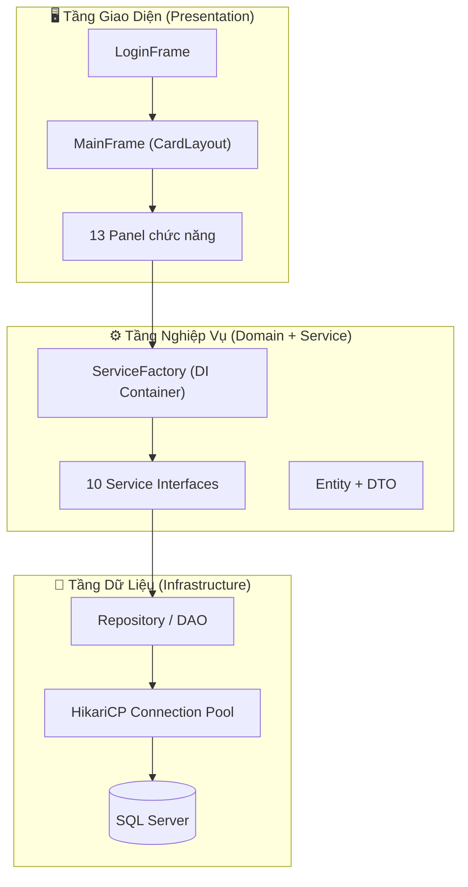
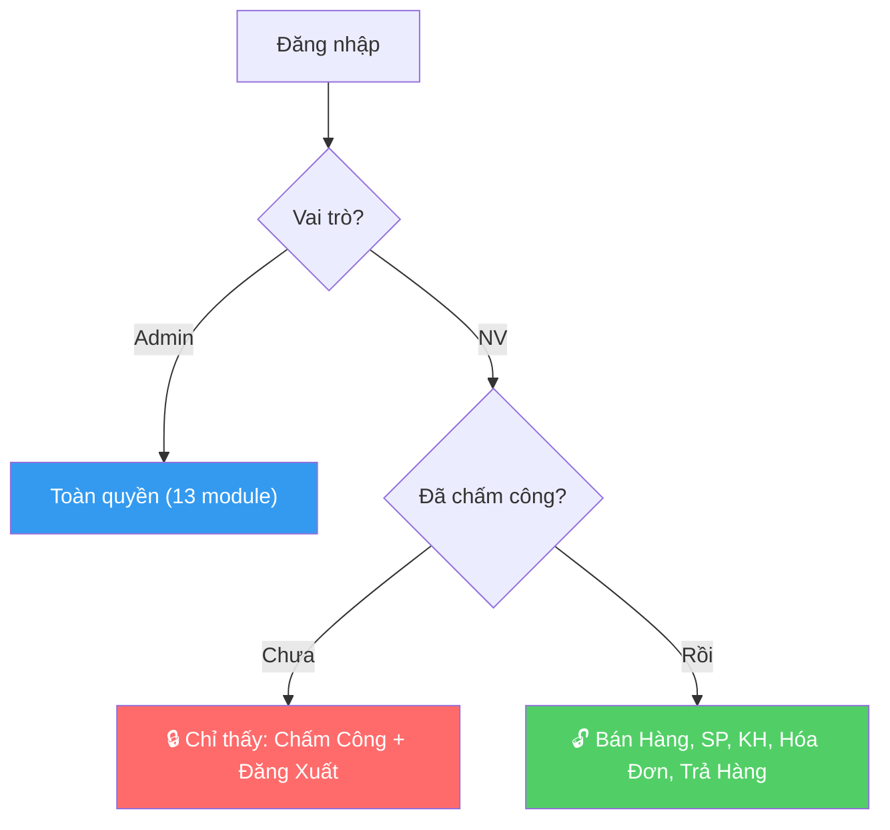

# 🎤 TÀI LIỆU THUYẾT TRÌNH DỰ ÁN — MerPhar
## Hệ Thống Quản Lý Cửa Hàng Thuốc

> **Nhóm dự án:** eProject — FPT Aptech  
> **Công nghệ:** Java Swing + SQL Server + Clean Architecture  
> **Tổng module:** 13 module hoạt động  
> **Tổng dòng code:** ~20,000+

---

## 📌 MỤC LỤC THUYẾT TRÌNH

| STT | Module | Slide |
|-----|--------|-------|
| 0 | Kiến trúc tổng quan | [Slide 0](#slide-0-kiến-trúc-tổng-quan) |
| 1 | Đăng nhập (LoginFrame) | [Slide 1](#slide-1-đăng-nhập) |
| 2 | Dashboard & Báo cáo (ReportPanel) | [Slide 2](#slide-2-dashboard--báo-cáo) |
| 3 | Máy chấm công (TimeclockPanel) | [Slide 3](#slide-3-máy-chấm-công) |
| 4 | Bán hàng POS (POSPanel) | [Slide 4](#slide-4-bán-hàng-pos) |
| 5 | Nhập kho (ImportPanel) | [Slide 5](#slide-5-nhập-kho) |
| 6 | Quản lý kho (InventoryPanel) | [Slide 6](#slide-6-quản-lý-kho) |
| 7 | Nhà cung cấp (SupplierPanel) | [Slide 7](#slide-7-nhà-cung-cấp) |
| 8 | Khách hàng (CustomerPanel) | [Slide 8](#slide-8-khách-hàng) |
| 9 | Hóa đơn & Trả hàng (InvoicePanel) | [Slide 9](#slide-9-hóa-đơn--trả-hàng) |
| 10 | Quản lý người dùng (UserMgmtPanel) | [Slide 10](#slide-10-quản-lý-người-dùng) |
| 11 | Nhân sự HRM (HrAdminPanel) | [Slide 11](#slide-11-nhân-sự-hrm) |
| 12 | Lịch sử chấm công (AttendanceHistoryPanel) | [Slide 12](#slide-12-lịch-sử-chấm-công) |
| 13 | Bảng lương (PayrollPanel) | [Slide 13](#slide-13-bảng-lương) |
| 14 | Phân quyền & Bảo mật | [Slide 14](#slide-14-phân-quyền--bảo-mật) |

---

## Slide 0: Kiến Trúc Tổng Quan

### 🏗️ Kiến trúc: Clean Architecture 3 tầng



### 💡 Điểm nhấn thuyết trình

> **"Mọi Panel trên giao diện KHÔNG bao giờ biết Database là gì."**
> 
> Panel chỉ gọi `ServiceFactory.getSaleService()` → nhận Interface `ISaleService` → gọi method.
> Phía sau, `SaleServiceImpl` lo xử lý logic, gọi `IBatchRepository`, rồi `BatchRepositoryImpl` mới chạm vào SQL Server.
> 
> → **Lợi ích:** Khi đổi từ SQL Server sang PostgreSQL, chỉ cần viết lại tầng Infrastructure. Toàn bộ 13 Panel không sửa 1 dòng nào.

### 📦 Công nghệ sử dụng

| Thành phần | Công nghệ | Vai trò |
|------------|-----------|---------|
| Ngôn ngữ | Java 25 | Core language |
| UI | Java Swing + FlatLaf | Giao diện desktop hiện đại |
| Database | Microsoft SQL Server | Lưu trữ dữ liệu |
| Connection Pool | HikariCP | Quản lý kết nối hiệu suất cao |
| PDF | OpenPDF | Xuất hóa đơn, báo cáo |
| QR | VietQR API | Thanh toán bằng QR ngân hàng |
| Build | Apache Maven | Quản lý dependency |

---

## Slide 1: Đăng Nhập

### 📄 File: [LoginFrame.java](file:///d:/eproject/eProject-StoreBanThuoc/src/main/java/presentation/LoginFrame.java) — 173 dòng

### 🎯 Chức năng
- Nhập tên đăng nhập + mật khẩu → xác thực qua `IAuthService`
- Phân quyền: **Admin** → vào Dashboard | **Nhân viên** → vào Máy chấm công
- Theo dõi trạng thái Online/Offline (giống Facebook)

### 🔄 Luồng hoạt động

```
Người dùng nhập username + password
  → nhấn Enter hoặc click "Đăng Nhập"
  → ServiceFactory.getAuthService().login(username, password)
  → AuthServiceImpl kiểm tra NguoiDung trong DB
  → Nếu đúng: Session.setCurrentUser(user) → Session.goOnline()
  → Mở MainFrame, hủy LoginFrame
  → Nếu sai: hiện thông báo lỗi, xóa mật khẩu
  → Nếu tài khoản bị khóa: "Tài khoản đã bị vô hiệu hóa!"
```

### ✨ Kỹ thuật nổi bật

| Kỹ thuật | Cách thực hiện |
|----------|----------------|
| Placeholder text | `FlatClientProperties.PLACEHOLDER_TEXT` — hiện chữ mờ khi chưa nhập |
| Enter to login | `KeyAdapter` bắt phím `VK_ENTER` trên cả 2 ô input |
| Hover effect | `MouseListener` đổi màu nút khi di chuột vào |
| Online tracking | `UPDATE NguoiDung SET DangOnline = 1` khi login thành công |
| Offline on exit | `WindowListener` + `ShutdownHook` → `DangOnline = 0` khi đóng app |

### 💻 Code minh họa

```java
// LoginFrame.java — Xử lý đăng nhập
private void doLogin() {
    String username = txtUsername.getText().trim();
    String password = new String(txtPassword.getPassword()).trim();
    try {
        User user = authService.login(username, password);  // Gọi qua Interface
        Session.setCurrentUser(user);   // Lưu user vào Session toàn cục
        Session.goOnline();             // Đánh dấu online trong DB
        new MainFrame().setVisible(true);
        this.dispose();
    } catch (IllegalArgumentException ex) {
        JOptionPane.showMessageDialog(this, ex.getMessage(), "Lỗi", JOptionPane.ERROR_MESSAGE);
    }
}
```

---

## Slide 2: Dashboard & Báo Cáo

### 📄 File: [ReportPanel.java](file:///d:/eproject/eProject-StoreBanThuoc/src/main/java/presentation/panel/ReportPanel.java) — 812 dòng | 🔒 Admin only

### 🎯 Chức năng
- **4 KPI Cards**: Doanh thu thuần, Tổng hóa đơn, Chi phí nhập kho, Lợi nhuận ròng
- **4 Bảng phân tích** (bố cục 2×2): Top 10 SP bán chạy, Top Khách VIP, Top NCC, Cảnh báo tồn kho
- Lọc theo **Quý + Năm**
- Xuất **báo cáo PDF**

### ✨ Kỹ thuật nổi bật

| Kỹ thuật | Mô tả |
|----------|-------|
| Layout 2×2 | `JSplitPane` lồng nhau — 4 bảng cùng lúc không cần cuộn |
| Cảnh báo 3 loại | `UNION ALL` (Hết hàng + Sắp hết + Cận Date) trong 1 câu SQL |
| Right-click drill-down | Click chuột phải bảng cảnh báo → xem chi tiết lô hàng |
| Real-time KPI | Mỗi lần đổi filter → query lại toàn bộ aggregate functions |

### 💻 Code minh họa — Câu SQL phức tạp nhất

```sql
-- 3 loại cảnh báo tồn kho gộp thành 1 bảng
-- 1. HẾT HÀNG: SP không còn lô nào có SoLuong > 0
SELECT sp.TenSP, 0 AS TongTon, N'Hết hàng' AS TrangThai FROM SanPham sp
WHERE NOT EXISTS (SELECT 1 FROM LoHang l WHERE l.MaSP = sp.MaSP AND l.SoLuong > 0)
UNION ALL
-- 2. SẮP HẾT: Tổng tồn > 0 nhưng <= 10
SELECT sp.TenSP, SUM(l.SoLuong), N'Sắp hết' FROM SanPham sp JOIN LoHang l ...
WHERE SUM <= 10
UNION ALL
-- 3. CẬN DATE: Lô hàng sẽ hết hạn trong vòng 30 ngày
SELECT sp.TenSP, COUNT(l.MaLo) + N' lô', N'Cận date' FROM LoHang l ...
WHERE l.HanSuDung <= DATEADD(MONTH, 1, GETDATE())
ORDER BY SortOrder
```

---

## Slide 3: Máy Chấm Công

### 📄 File: [TimeclockPanel.java](file:///d:/eproject/eProject-StoreBanThuoc/src/main/java/presentation/panel/TimeclockPanel.java) — 351 dòng

### 🎯 Chức năng
- Đồng hồ số real-time (cập nhật mỗi giây)
- Nhân viên nhập **mã PIN** để **Nhận ca** hoặc **Kết ca**
- Tự động tính: giờ đi trễ, giờ tăng ca, tổng giờ làm
- **Mở khóa hệ thống** sau khi nhận ca thành công

### 🔄 Luồng Nhận Ca

```
NV nhập PIN → hệ thống kiểm tra:
  ① Đã có ca hôm nay chưa? (HR_Schedules)
  ② Đang trong ca rồi? (HR_Attendances.ClockOut IS NULL)
  ③ Chưa đến giờ? (chỉ cho nhận ca trước 15 phút)
  ④ Đi trễ hơn 15 phút? → Bắt nhập lý do
  
→ INSERT HR_Attendances (Snapshot lương + giờ ca)
→ Xóa lịch nghỉ phép cùng ngày (nếu có)
→ MainFrame.refreshSidebar() → MỞ KHÓA các tab
```

### 📋 Quy tắc nghiệp vụ

| Rule | Mô tả |
|------|-------|
| Nhận ca sớm | Chỉ cho phép 15 phút trước giờ bắt đầu ca |
| Không có ca | Không cho nhận ca nếu không có lịch hôm nay |
| Kết ca sớm | Cảnh báo + bắt buộc điền lý do |
| Tăng ca | Làm quá giờ → bắt buộc điền lý do tăng ca |
| Trùng ca | Đang trong ca → thông báo "hãy kết ca trước" |
| Auto No-Show | Khi khởi động app, tự đánh dấu NV vắng mặt ngày hôm qua |

### ✨ Kỹ thuật: Frozen Shift Config (Snapshot)

> **Vấn đề:** Admin cấu hình ca sáng 6h–14h (8 tiếng), nhưng xếp ca từ 5h–14h (9 tiếng). NV phải được tính 1 giờ tăng ca.
> 
> **Giải pháp:** Khi NV nhận ca, hệ thống **chụp ảnh (snapshot)** giờ cấu hình gốc (`ShiftDefaultStart/End`) + lương (`SnapshotRate`) tại thời điểm đó. Nếu admin đổi cấu hình sau, các ca đã được nhận KHÔNG bị ảnh hưởng.

---

## Slide 4: Bán Hàng POS

### 📄 File: [POSPanel.java](file:///d:/eproject/eProject-StoreBanThuoc/src/main/java/presentation/panel/POSPanel.java) — 1,439 dòng | ⭐ Module phức tạp nhất

### 🎯 Chức năng
- Giao diện chia đôi: Bảng sản phẩm (trái) + Giỏ hàng & Thanh toán (phải)
- Tìm sản phẩm (tự động chờ 250ms trước khi gọi DB — debounce)
- Giỏ hàng: Thêm / Sửa số lượng / Xóa
- Khách hàng: Nhập SĐT → tự gợi ý tên
- Thanh toán: Tiền mặt hoặc QR Code (VietQR)
- Giữ đơn tạm (Hold Order) với badge đỏ
- Xuất hóa đơn PDF tự động

### 🔄 Luồng Thanh Toán (Checkout)

```
NV bấm "Thanh Toán"
  → SwingWorker chạy nền (không đơ giao diện)
  → SaleServiceImpl.checkout():
      conn.setAutoCommit(false)                    ← BẮT ĐẦU GIAO DỊCH
      
      ① Tìm hoặc tạo Khách hàng (theo SĐT)
      ② INSERT HoaDon (header)
      ③ Vòng lặp FEFO cho từng sản phẩm:
         → SELECT lô gần hạn nhất WITH (UPDLOCK)  ← KHÓA DÒNG
         → UPDATE LoHang SET SoLuong -= số bán     ← TRỪ KHO
         → INSERT ChiTietHoaDon (snapshot GiaVon)  ← LƯU GIÁ VỐN
      ④ UPDATE HoaDon tổng tiền
      
      conn.commit()                                ← XÁC NHẬN GIAO DỊCH
  → Hiện hóa đơn PDF + Reset giỏ hàng
```

### 🔴 6 Vấn Đề Chí Tử Đã Giải Quyết

| # | Vấn đề | Hậu quả nếu không fix | Giải pháp |
|---|--------|----------------------|-----------|
| 1 | Bán thuốc cũ trước | Thuốc gần hạn nằm lại → hết hạn → lỗ | **Thuật toán FEFO** — `ORDER BY HanSuDung ASC` |
| 2 | Bán thuốc hết hạn | Vi phạm pháp luật y tế | **Filter server-side** — `HanSuDung > GETDATE()` |
| 3 | Dữ liệu nửa vời | Có hóa đơn nhưng kho chưa trừ | **Transaction** — `setAutoCommit(false)` + rollback |
| 4 | 2 NV bán cùng lúc | Kho âm (overselling) | **SQL Lock** — `WITH (UPDLOCK, ROWLOCK)` |
| 5 | Sai giá vốn báo cáo | Lợi nhuận tính sai | **Snapshot GiaVon** lúc bán |
| 6 | UI bị đơ | NV bực mình, khách chờ lâu | **SwingWorker** — xử lý nền |

### 💻 Code minh họa — Thuật toán FEFO + Khóa dòng

```java
// SaleServiceImpl.java — Bán từ lô gần hạn nhất
private boolean processCartItemFEFO(Connection conn, int maHD, CartItem item) {
    int remaining = item.getSoLuong();
    List<Batch> lots = batchRepo.getFEFO(conn, item.getMaSP());  // ★ UPDLOCK
    
    for (Batch lot : lots) {
        if (remaining <= 0) break;
        int deduct = Math.min(remaining, lot.getSoLuong());
        
        batchRepo.updateQuantity(conn, lot.getMaLo(), lot.getSoLuong() - deduct);
        detailRepo.insert(conn, new InvoiceDetail(
            maHD, lot.getMaLo(), deduct,
            item.getGiaBan(),      // Giá bán cho khách
            lot.getGiaNhap()       // ★ Snapshot giá vốn từ lô
        ));
        remaining -= deduct;       // Nếu lô này không đủ → tự động sang lô kế
    }
    return remaining <= 0;
}
```

```sql
-- BatchRepositoryImpl.java — FEFO + Khóa dòng chống bán trùng
SELECT MaLo, SoLuong, GiaNhap
FROM LoHang WITH (UPDLOCK, ROWLOCK)   -- ★ NV khác phải CHỜ
WHERE MaSP = ? AND SoLuong > 0 AND HanSuDung > GETDATE()
ORDER BY HanSuDung ASC               -- ★ Lô gần hạn lên đầu
```

---

## Slide 5: Nhập Kho

### 📄 File: [ImportPanel.java](file:///d:/eproject/eProject-StoreBanThuoc/src/main/java/presentation/panel/ImportPanel.java) — 666 dòng | 🔒 Admin only

### 🎯 Chức năng
- Nhập thông tin sản phẩm (auto-suggest tên SP có sẵn)
- Nhập thông tin lô hàng (số lô, NCC, hạn sử dụng, số lượng, giá nhập)
- Giỏ nhập (JTable) + Xác nhận nhập hàng
- **Bắt buộc chọn Nhà Cung Cấp** trước khi lưu

### 🏗️ Kiến trúc: MVP Pattern

> Module này dùng pattern **Model-View-Presenter** — khác với các module khác!

```
ImportPanel (View)         →  Chỉ chứa UI, KHÔNG có logic
    ↕ IImportView          →  Interface giao tiếp
ImportPresenter (Logic)    →  Xử lý validation, build data
    ↓
NhapKhoDAO (Data)          →  Transaction INSERT PhieuNhap + N LoHang
```

### 🔄 Luồng Nhập Kho

```
Admin nhập tên SP → Debounce 250ms → gợi ý SP có sẵn
  → Nếu SP mới: hiện "[Mới] Tên SP" → tự tạo SP mới khi lưu
  → Điền số lô, HSD, SL, giá nhập → "Thêm vào giỏ"
  → Lặp lại cho nhiều lô hàng
  → Bấm "Lưu Phiếu Nhập"
    → BEGIN TRANSACTION
      ① INSERT PhieuNhap → lấy MaPN
      ② Loop: check SP tồn tại? → INSERT mới hoặc UPDATE giá
      ③ Loop: INSERT LoHang cho từng lô
      ④ UPDATE PhieuNhap.TongTien = SUM(giá nhập)
    → COMMIT
```

### ✨ Kỹ thuật nổi bật

| Kỹ thuật | Mô tả |
|----------|-------|
| Auto-suggest | Debounce 250ms + popup gợi ý tên SP |
| SP cache | `Map<String, Integer>` tránh INSERT trùng SP mới 2 lần |
| Money format | `DocumentListener` tự thêm dấu phẩy (25,000) |
| DatePicker | Custom component chọn ngày hạn sử dụng |
| NCC validation | ★ Bắt buộc chọn NCC, không cho lưu phiếu rỗng |

---

## Slide 6: Quản Lý Kho

### 📄 File: [InventoryPanel.java](file:///d:/eproject/eProject-StoreBanThuoc/src/main/java/presentation/panel/InventoryPanel.java) — 1,406 dòng | 🔒 Admin only

### 🎯 Chức năng
- Xem toàn bộ lô hàng: Số Lô, Tên SP, SL, Giá Nhập, HSD, NCC, Người nhập
- **CRUD lô hàng**: Thêm / Sửa / Xóa (kiểm tra ràng buộc khóa ngoại)
- **Phân trang** server-side (20 dòng/trang)
- **Sorting** server-side (click header bảng)
- 3 tab: Kho chính | Lịch sử trả hàng | Lịch sử hủy

### ✨ Kỹ thuật: Phân trang Server-Side

> **Vấn đề:** Nếu tải toàn bộ 10,000 lô hàng lên Java → app đơ.
> 
> **Giải pháp:** Chỉ tải đúng 20 dòng mỗi lần bằng `OFFSET...FETCH NEXT`:

```sql
SELECT l.MaLo, sp.TenSP, l.SoLuong, l.GiaNhap, l.HanSuDung
FROM LoHang l JOIN SanPham sp ON l.MaSP = sp.MaSP
ORDER BY l.HanSuDung ASC      -- Safe column (Whitelist)
OFFSET 40 ROWS                -- Bỏ qua 2 trang đầu (40 dòng)
FETCH NEXT 20 ROWS ONLY       -- Chỉ lấy 20 dòng trang hiện tại
```

```java
// Chống SQL Injection khi sort — Whitelist column mapping
private static final String[] SORT_SQL = {
    "l.MaLo", "sp.TenSP", "l.SoLuong", "l.GiaNhap", "l.HanSuDung"
};
// Chỉ cho sort theo index có sẵn → KHÔNG ghép string user input
```

---

## Slide 7: Nhà Cung Cấp

### 📄 File: [SupplierPanel.java](file:///d:/eproject/eProject-StoreBanThuoc/src/main/java/presentation/panel/SupplierPanel.java) — 922 dòng | 🔒 Admin only

### 🎯 Chức năng
- CRUD: Tên NCC, SĐT, Địa chỉ, Email, Trạng thái
- **Xóa mềm (Soft Delete)**: "Ngừng hợp tác" → `TrangThai = 0` (không xóa thật)
- Filter: Keyword + Trạng thái (Hoạt động / Ngừng HT)
- Right-click → **popup chi tiết** lịch sử nhập kho của NCC
- Phân trang + Sorting server-side

### 💡 Tại sao dùng Soft Delete?

> Nếu xóa thật NCC → tất cả Phiếu Nhập cũ liên quan sẽ mất dữ liệu NCC!  
> Hệ thống chỉ đổi trạng thái, NCC "Ngừng HT" vẫn hiển thị trong lịch sử nhập kho.

### ✨ Kỹ thuật: Validation

| Check | SQL/Logic |
|-------|-----------|
| Trùng tên NCC | `SELECT COUNT FROM NhaCungCap WHERE TenNCC = ?` (case-insensitive) |
| Email hợp lệ | Regex: `^[\w.%+-]+@[\w.-]+\.[a-zA-Z]{2,}$` |
| Xóa mềm | `UPDATE NhaCungCap SET TrangThai = 0 WHERE MaNCC = ?` |

---

## Slide 8: Khách Hàng

### 📄 File: [CustomerPanel.java](file:///d:/eproject/eProject-StoreBanThuoc/src/main/java/presentation/panel/CustomerPanel.java) — 1,005 dòng

### 🎯 Chức năng
- **Tab 1 — KH đã đăng ký**: CRUD + Tìm kiếm + Phân trang + Lịch sử mua hàng
- **Tab 2 — Khách vãng lai**: Danh sách hóa đơn không có SĐT/tên
- Double-click hoặc Right-click → popup **chi tiết lịch sử mua hàng**

### 📋 Phân quyền

| Vai trò | Quyền |
|---------|-------|
| Admin | Full CRUD (Thêm, Sửa, Xóa) |
| Nhân viên | Chỉ xem (ẩn form bên trái) |

### ✨ Kỹ thuật

| Kỹ thuật | Mô tả |
|----------|-------|
| Phone filter | `DocumentFilter` chỉ cho nhập số vào ô SĐT |
| Unique SĐT | Bắt exception `UQ_KhachHang_SoDT` → "SĐT đã tồn tại!" |
| Tổng chi tiêu | Tính từ DB, hiện màu xanh lá + chữ đậm |
| Debounce search | Timer 300ms tránh spam DB khi gõ liên tục |

---

## Slide 9: Hóa Đơn & Trả Hàng

### 📄 File: [InvoicePanel.java](file:///d:/eproject/eProject-StoreBanThuoc/src/main/java/presentation/panel/InvoicePanel.java) — 673 dòng

### 🎯 Chức năng
- **3 Tab**: Hóa đơn bán | Phiếu nhập kho | Hóa đơn đã hủy
- Filter: Khoảng ngày, Mã HĐ, Tên KH
- Double-click → **xem chi tiết hóa đơn**
- Right-click menu:
  - **Trả hàng** (cả Admin và NV) → `ReturnInvoiceDialog`
  - **Hủy hóa đơn** (chỉ Admin) → hoàn kho tự động

### 🔄 Luồng Trả Hàng

```
Right-click HĐ → "Trả hàng" → ReturnInvoiceDialog mở ra
  → Hiện bảng: TênSP, SốLô, ĐãMua, ĐãTrả, CóThểTrả, SLTrả (spinner)
  → NV nhập SL trả + lý do → Xác nhận
  → Build XML chứa danh sách lô cần trả
  → Gọi Stored Procedure: sp_TraHangKhach(@MaHDGoc, @MaND, @LyDo, @XML)
  → SP: INSERT HoaDon(RETURN) + hoàn trả tồn kho
```

### ✨ Stored Procedure trả hàng (tóm tắt)

```sql
EXEC sp_TraHangKhach @MaHDGoc = 101, @MaND = 7, @LyDo = N'Sai thuốc'
-- ① Validate HĐ gốc (phải đang SALE + Thanh cong)
-- ② Parse XML items → lấy danh sách MaLo + SoLuong
-- ③ INSERT HoaDon mới (LoaiHD = 'RETURN', TongTien ÂM, MaHDGoc = 101)
-- ④ INSERT ChiTietHoaDon (SoLuong ÂM)
-- ⑤ UPDATE LoHang SET SoLuong += SLTrả  → Hoàn kho
```

---

## Slide 10: Quản Lý Người Dùng

### 📄 File: [UserManagementPanel.java](file:///d:/eproject/eProject-StoreBanThuoc/src/main/java/presentation/panel/UserManagementPanel.java) — 874 dòng | 🔒 Admin only

### 🎯 Chức năng
- CRUD người dùng: Tên đăng nhập, Mật khẩu, Họ tên, Vai trò
- **Khóa / Mở khóa** tài khoản
- **Reset mật khẩu** về mặc định (123456)
- **Online indicator**: ● Online (xanh lá) / ○ Offline (xám) — giống Facebook

### 🛡️ Quy tắc bảo vệ

| Quy tắc | Mục đích |
|---------|----------|
| Không thể khóa chính mình | Tránh admin tự khóa tài khoản |
| Không thể hạ quyền chính mình | Luôn còn ít nhất 1 admin |
| Username không đổi khi sửa | Username là định danh vĩnh viễn |
| Kiểm tra trùng username | `isDuplicateUsername()` trước khi thêm |

---

## Slide 11: Nhân Sự HRM

### 📄 File: [HrAdminPanel.java](file:///d:/eproject/eProject-StoreBanThuoc/src/main/java/presentation/panel/HrAdminPanel.java) — 1,493 dòng | 🔒 Admin only | ⭐ Module lớn nhất

### 🎯 Chức năng — 5 Tab

| Tab | Tên | Chức năng |
|-----|-----|-----------|
| 1 | **Quản lý Nhân viên** | CRUD: Tên, PIN, SĐT, Lương/giờ, TK Đăng nhập liên kết |
| 2 | **Cấu Hình Ca** | CRUD ca làm: Tên ca, Giờ bắt đầu, Giờ kết thúc |
| 3 | **Xếp Ca Theo Tuần** | Chọn NV + Ca + Khoảng ngày → Bulk insert lịch tuần |
| 4 | **Lịch Sử Ca Làm** | [AttendanceHistoryPanel](#slide-12-lịch-sử-chấm-công) |
| 5 | **Bảng Lương Tháng** | [PayrollPanel](#slide-13-bảng-lương) |

### ✨ Kỹ thuật — Xếp Ca

| Kỹ thuật | Mô tả |
|----------|-------|
| Bulk insert | Chọn NV + Ca + Tuần → insert 7 dòng 1 lần |
| 1 ca/ngày | Kiểm tra trước khi thêm, không cho xếp 2 ca/ngày |
| Leave management | Xếp "Nghỉ phép" → ActualStart/End = NULL |
| Leave quota | `getLeaveBalance()` — tính ngày phép còn lại real-time |
| Right-click | Sửa / Xóa schedule |

### 🔧 Fix Bug Nghiêm Trọng: Tráo MaND

> **Bug:** Hệ thống cũ ghép NV ↔ Tài khoản **bằng tên** (`FullName = HoTen`).  
> Nếu tên không khớp Unicode hoặc 2 NV trùng tên → **tráo MaND nhầm** → NV A đăng nhập thấy ca của NV B.
> 
> **Fix:** Thêm ComboBox **"TK Đăng nhập"** — Admin chọn tài khoản rõ ràng khi thêm/sửa NV.  
> INSERT/UPDATE ghi MaND trực tiếp, không dùng name-matching.

---

## Slide 12: Lịch Sử Chấm Công

### 📄 File: [AttendanceHistoryPanel.java](file:///d:/eproject/eProject-StoreBanThuoc/src/main/java/presentation/panel/AttendanceHistoryPanel.java) — 484 dòng

### 🎯 Chức năng
- Xem lịch sử chấm công toàn bộ nhân viên
- Filter: Khoảng ngày (mặc định 3 ngày gần nhất)
- Phân trang 50 dòng/trang
- Right-click menu:
  - **Sửa giờ thủ công** — Admin chỉnh giờ vào/ra + tự tính lại TotalHours
  - **Xem chi tiết ca** → ShiftDetailsDialog
  - **Xem doanh thu trong ca** → JOIN HoaDon theo timerange

### ✨ Kỹ thuật — Cross-Module Link

> Click "Xem doanh thu ca" → hệ thống JOIN bảng `HoaDon` theo khoảng thời gian `ClockIn ~ ClockOut` của NV → hiện tổng doanh thu + số hóa đơn trong ca đó.

### 🎨 Color Coding

| Màu | Ý nghĩa |
|-----|---------|
| 🔴 Đỏ | NV đi trễ |
| 🟢 Xanh | NV có tăng ca |
| ⚫ Đen | Ca bình thường |

---

## Slide 13: Bảng Lương

### 📄 File: [PayrollPanel.java](file:///d:/eproject/eProject-StoreBanThuoc/src/main/java/presentation/panel/PayrollPanel.java) — 454 dòng

### 🎯 Chức năng
- Bảng lương theo Tháng / Năm
- Tự động tính: **Tổng giờ × Lương/giờ = Lương tháng**
- Thanh toán: **Đơn lẻ** hoặc **Tất cả**
- Trạng thái: 🔴 Chờ thanh toán | 🟢 Đã thanh toán | ⚫ Không có ca

### 🔄 Công thức tính lương

```
Lương tháng = (Giờ thường × SnapshotRate) + (Giờ tăng ca × SnapshotOTRate)
```

> **Lưu ý:** Dùng `SnapshotRate` (lương lúc nhận ca), KHÔNG dùng lương hiện tại.  
> Nếu admin tăng lương giữa tháng, các ca đã làm trước đó vẫn tính theo lương cũ.

### 💻 Code minh họa — SQL Tính Lương

```sql
SELECT e.EmpID, e.FullName,
  SUM(att.TotalHours) AS TongGio,
  SUM(att.DailyEarned) AS TongTien     -- ★ Dùng snapshot, không query lại lương
FROM HR_Employees e
LEFT JOIN HR_Attendances att ON att.EmpID = e.EmpID
  AND MONTH(att.ClockIn) = @Month AND YEAR(att.ClockIn) = @Year
  AND att.ClockOut IS NOT NULL
GROUP BY e.EmpID, e.FullName
```

---

## Slide 14: Phân Quyền & Bảo Mật

### 🔐 Hệ thống phân quyền 3 cấp



### 📋 Ma trận phân quyền chi tiết

| Module | Admin | NV (đã chấm công) | NV (chưa chấm công) |
|--------|:-----:|:-----------------:|:-------------------:|
| Dashboard | ✅ | ❌ | ❌ |
| Chấm Công | ✅ | ✅ | ✅ *(duy nhất)* |
| Bán Hàng | ✅ | ✅ | 🔒 |
| Nhập Kho | ✅ | ❌ | ❌ |
| Sản Phẩm | ✅ CRUD | ✅ Xem | 🔒 |
| Quản Lý Kho | ✅ | ❌ | ❌ |
| Nhà Cung Cấp | ✅ | ❌ | ❌ |
| Khách Hàng | ✅ CRUD | ✅ Xem | 🔒 |
| Hóa Đơn | ✅ | ✅ | 🔒 |
| Trả Hàng | ✅ | ✅ | 🔒 |
| Hủy Hóa Đơn | ✅ | ❌ | ❌ |
| Nhân Sự HRM | ✅ | ❌ | ❌ |
| Người Dùng | ✅ | ❌ | ❌ |
| Bảng Lương | ✅ | ❌ | ❌ |

### 🛡️ Cơ chế bảo mật

| Lớp | Kỹ thuật | Mục đích |
|-----|----------|----------|
| **UI** | `setVisible(false)` trên sidebar | NV không thấy nút → không click được |
| **Service** | `checkAdminPermission()` đầu mỗi method | Ngay cả nếu bypass UI, Service vẫn chặn |
| **Session** | `Session.isClockedIn()` query DB real-time | Xác minh NV thực sự đang trong ca |
| **Database** | `UPDLOCK + ROWLOCK` | Chống race condition khi 2 NV bán cùng lúc |
| **Database** | `Transaction (ACID)` | Đảm bảo dữ liệu toàn vẹn |
| **Database** | Soft Delete (NCC, NV) | Không bao giờ mất dữ liệu lịch sử |

---

## 📊 Bảng Tổng Kết

| # | Module | Dòng code | Pattern | Tính năng nổi bật |
|---|--------|:---------:|---------|-------------------|
| 0 | Login | 173 | Service | Auth + Session + Online tracking |
| 1 | Dashboard | 812 | Service | 4 KPI + 4 bảng + 3 loại cảnh báo |
| 2 | Chấm Công | 351 | DAO | PIN, real-time clock, sidebar unlock |
| 3 | **Bán Hàng** | **1,439** | Service | FEFO, UPDLOCK, Transaction, QR, Hold |
| 4 | Nhập Kho | 666 | **MVP** | Auto-suggest, NCC required, atomic |
| 5 | Quản Lý Kho | 1,406 | DAO | Server-side sort + pagination |
| 6 | NCC | 922 | DAO | Soft Delete + lịch sử nhập |
| 7 | Khách Hàng | 1,005 | Service | 2 tab + purchase history |
| 8 | Hóa Đơn | 673 | Service | 3 tab + void + return (SP) |
| 9 | Người Dùng | 874 | DAO | Lock/Unlock + Online indicator |
| 10 | **HRM** | **1,493** | Service | 5 tab + frozen config + leave |
| 11 | Lịch sử CC | 484 | DAO | Manual edit + revenue cross-link |
| 12 | Bảng Lương | 454 | DAO | Payroll calc + batch payment |

### Tổng: ~20,000+ dòng code | 13 module | 10 service interfaces | 8+ repositories

---

> [!TIP]
> **Khi thuyết trình:** Tập trung vào **Module 4 (POS)** và **Module 3 (Chấm Công)** — đây là 2 module có logic nghiệp vụ phức tạp nhất, thể hiện rõ nhất năng lực kỹ thuật của nhóm (FEFO, Transaction, Locking, Snapshot Pattern).
